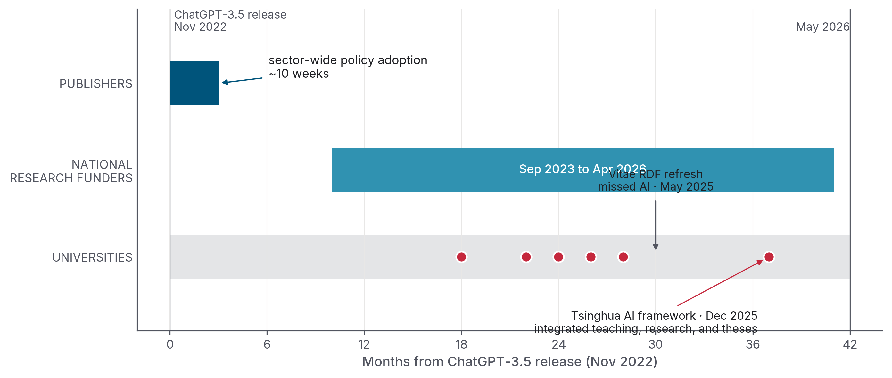

::: cover

{.cover-logo}

::: kicker
INSTATS POLICY SERIES &nbsp;·&nbsp; May 2026
:::

# Responsible AI in Academic Research
## *A Capability Framework for Research Training*

::: abstract
What does responsible AI use look like for academic research, and how would a university know whether it is doing it well? The short answer: of thirty-eight top-tier doctoral universities surveyed across fifteen countries and jurisdictions, **only six** have AI policies that extend past research integrity into AI literacy and valid research practices. The world's major academic publishers, by contrast, issued a substantively identical no-AI-co-author policy across the sector within ten weeks of ChatGPT-3.5's public release. The United Kingdom's canonical PhD-researcher-development framework, refreshed in 2025, did not treat AI as a competency at all. While publishers and funders have responded to the emergence of AI, the universities that actually train researchers are lagging far behind what is needed to prepare them to use it responsibly.
:::

::: author
**Michael J. Zyphur, PhD**
Instats &nbsp;·&nbsp; [instats.org](https://instats.org) &nbsp;·&nbsp; [support@instats.org](mailto:support@instats.org)
:::

INSTATS-PS-2026-04

:::

\newpage

::: colophon

**Citation.** Zyphur, M. J. (2026). *Responsible AI in Academic Research: A Capability Framework for Research Training.* Instats Policy Series, v1.1.0. [github.com/mzyphur/responsible-ai-in-research-training](https://github.com/mzyphur/responsible-ai-in-research-training). ORCID: [0000-0003-3237-7892](https://orcid.org/0000-0003-3237-7892). DOI: 10.61700/t31oy23grr.

**License.** Creative Commons Attribution-NonCommercial 4.0 International (CC BY-NC 4.0). Share and adapt with attribution; commercial reuse requires written permission from the author.

**Scope and method.** This is the global view in a planned regional series. The capability framework in Part 2 is intended to be re-populated in later reports for the US / Americas, the UK / Europe, and APAC ex Japan; the framework itself does not change across those reports. The evidence base in Parts 1 and 3 draws on four primary dossiers, snapshotted 2026-05-18: national research-funder AI policies across fourteen funders in eleven countries plus the EU's European Research Council as a supranational fourteenth-funder; institutional AI policies across thirty-eight top-tier doctoral universities in fifteen countries and jurisdictions; the existing AI-literacy and researcher-development capability-framework literature; and the AI co-authorship and use policies of eighteen major publishers plus three preprint servers. Every claim is anchored to a primary source URL with a snapshot date.

About this report, the AI-use disclosure, and the methodology summary are in [Appendix D](#appendix-d-about-this-report). The full source package is in [Appendix E](#appendix-e-sources). The regional-adaptation note for sister reports is in [Appendix F](#appendix-f-regional-adaptation-note).

:::

\newpage

::: exec

Executive summary

## The finding

Since ChatGPT-3.5's release in late 2022, major academic publishers, national research funders, and international capability-framework bodies have responded to AI in research. Publishers moved first and most uniformly: they issued substantively identical "no-AI-co-author" policies across the major journals within ten weeks of the release, later refining them into disclosure templates (Elsevier's "Declaration of Generative AI" section; JAMA's three-location rule; BMJ's submission-form integration). National research funders moved more slowly and unevenly, issuing AI-in-application policies between September 2023 and April 2026; the German Research Foundation went first, the Australian Research Council and the National Health and Medical Research Council went last. International capability-framework bodies have published the AI-literacy literature universities now cite as their reference: UNESCO's AI Competency Frameworks for Students and Teachers, the OECD-EC AILit Framework, the Council of Graduate Schools and INRS Global Action Agenda, the US National Academies' five-principles editorial.

Universities themselves — the institutions that actually train PhD researchers — have not caught up. Across thirty-eight top-tier doctoral universities in fifteen countries and jurisdictions, the modal institutional posture in 2026 is an AI-specific policy whose substantive scope ends at plagiarism. Only six universities of the thirty-eight publish AI policies that extend into research integrity, AI literacy, and valid research practices: two UK Doctoral-School-led documents (University College London Doctoral School; King's College London Centre for Education Studies); the Heidelberg Graduate Academy in Germany; KU Leuven in Belgium; the University of Helsinki in Finland; and Tsinghua's December 2025 university-wide AI framework in China. The United States' Ivy-Plus and Association of American Universities sample, despite hosting much of the AI research itself, falls uniformly in the weakest group. Vitae's Researcher Development Framework, the United Kingdom's canonical researcher-development standard, was refreshed in 2025 and did not treat AI as a competency at all.

LLMs are best understood as agentic research tools: task-directed systems that produce usable outputs, in the same family as statistical packages, transcription engines, code-generation assistants, and data-cleaning pipelines. They mimic human writing as a surface feature, not as their primary research function. The right question of any such tool is not who wrote the output but whether the use is ethical, valid, reproducible, and transparent. No one treats SPSS output as plagiarism. No one treats a Whisper-transcribed interview as fraudulent so long as the researcher verifies the transcript against the audio. The institutional move to treat AI use as a plagiarism question is a category error driven by surface mimicry rather than underlying function. The category error has three concrete consequences for institutional practice:

- *Responsible AI use is a research-integrity question, not an academic-integrity question.* Framing responsible AI use at PhD level as a plagiarism issue treats the binding constraint as student conduct rather than the validity, replicability, and ethical defensibility of AI-augmented research itself. Reproducibility, hallucination, validator-use, and adversarial-review competencies are research-integrity competencies. None of them is reducible to "do not present AI output as your own."
- *AI literacy at PhD level is not a tooling-skills problem; it is a judgement problem.* The competency that distinguishes a defensible AI-augmented PhD from an indefensible one is not which tool the candidate can drive, but which research tasks the candidate decides to give AI, which ones the candidate decides to keep, and how the candidate verifies whichever side carries the AI contribution. Tools change every six months; the judgement does not.
- *Policy alone is not the capability.* The most common institutional move in 2026 is to publish a single AI-policy document and treat the problem as closed. The capability sits across four institutional dimensions: the policy itself, the people responsible for enacting it, the systems that support it, and the process by which AI use enters supervision and examination. A policy is one row in the capability grid, not the grid.

Existing PhD-training and research-policy frameworks predate AI as a research tool. Frameworks refreshed since 2022 have, with very few exceptions, treated AI as an addendum rather than a categorical shift — and the Vitae refresh of 2025 demonstrates that even an active refresh cycle can miss the change. This report argues that universities require purpose-built, adaptive frameworks that address AI as an agentic research tool: not extensions to plagiarism policies, and not bolt-ons to researcher-development frameworks designed for a pre-2022 world. The ultimate goal of such frameworks is excellent research, achieved through excellent research training. The framework measures whether an institution can develop the judgement that separates defensible from indefensible AI use.

This report is written for senior university research leadership: Deputy Vice-Chancellors and Deputy Provosts of Research; Pro-Vice-Chancellors and Deputy Vice Presidents of Research; faculty Deans and Associate Deans of Research; Deans of Graduate Schools and Associate Deans of Research Training; committees for higher degrees and research-integrity committees; and the peak bodies that represent graduate students. The framework presented here has five dimensions and four maturity levels per dimension, calibrated against international evidence from thirty-eight universities, fourteen national research funders, and the major academic publishers. It is intended as a self-diagnosis instrument for that audience and a vocabulary for benchmarking institutional readiness across policy, curriculum, infrastructure, and governance.

The evidence supports a five-dimension capability framework, a maturity grid for institutional self-diagnosis, and audience-specific recommendations for the five leadership audiences named above.

:::

\newpage

{#fig:timeline width=100%}

**Figure 1.** *Publishers responded in months. National research funders responded over years. Universities still mostly haven't.* The six dots in the universities lane are the Class D universities — the only institutions with AI policies that extend past research integrity into AI literacy and valid research practices: UCL Doctoral School, KCL Centre for Education Studies, Heidelberg Graduate Academy, KU Leuven, University of Helsinki, and Tsinghua University. The remaining thirty-two institutions in the sample do not yet extend their AI policies into AI literacy and valid research practices. *Sources*: publisher dossier (18 publishers + 3 preprint servers, snapshotted 2026-05-18); funder dossier (14 national research funders + the European Research Council); institutional dossier (38 top-tier doctoral universities in 15 countries and jurisdictions); Vitae RDF refresh date from vitae.ac.uk.

\newpage

---

::: toc

# Contents

#### [Executive summary](#the-finding)

#### [Part 1 — The factual baseline](#part-1-the-factual-baseline_1)

- [1.1 &nbsp; The shift in research practice, 2022 to 2026](#11-the-shift-in-research-practice-2022-to-2026)
- [1.2 &nbsp; What "responsible AI use" still lacks a definition for](#12-what-responsible-ai-use-still-lacks-a-definition-for)
- [1.3 &nbsp; The institutional baseline in 2026](#13-the-institutional-baseline-in-2026)

#### [Part 2 — A five-dimension capability framework](#part-2-a-five-dimension-capability-framework_1)

- [2.1 &nbsp; Dimension 1 &mdash; Human-in-the-loop discipline](#21-dimension-1-human-in-the-loop-discipline)
- [2.2 &nbsp; Dimension 2 &mdash; Responsible use in practice](#22-dimension-2-responsible-use-in-practice)
- [2.3 &nbsp; Dimension 3 &mdash; Tooling that promotes responsible use](#23-dimension-3-tooling-that-promotes-responsible-use)
- [2.4 &nbsp; Dimension 4 &mdash; AI-literate humans](#24-dimension-4-ai-literate-humans)
- [2.5 &nbsp; Dimension 5 &mdash; Institutional benchmarking grid](#25-dimension-5-institutional-benchmarking-grid)

#### [Part 3 — What the international evidence shows](#part-3-what-the-international-evidence-shows_1)

- [3.1 &nbsp; National research-funder positions](#31-national-research-funder-positions)
- [3.2 &nbsp; Top-tier university institutional policies](#32-top-tier-university-institutional-policies)
- [3.3 &nbsp; Publisher and journal policies](#33-publisher-and-journal-policies)
- [3.4 &nbsp; Existing AI-literacy and researcher-development frameworks](#34-existing-ai-literacy-and-researcher-development-frameworks)

#### [Part 4 — The maturity grid](#part-4-the-maturity-grid_1)

- [4.1 &nbsp; The five-by-four grid](#41-the-five-by-four-grid)
- [4.2 &nbsp; What "ready" looks like by dimension](#42-what-ready-looks-like-by-dimension)
- [4.3 &nbsp; Worked institutional examples](#43-worked-institutional-examples)

#### [Part 5 — Recommendations for university research leadership](#part-5-recommendations-for-university-research-leadership_1)

- [5.1 &nbsp; For executive research leadership](#51-for-executive-research-leadership)
- [5.2 &nbsp; For faculty deans and associate deans of research](#52-for-faculty-deans-and-associate-deans-of-research)
- [5.3 &nbsp; For deans of graduate schools and A/Deans of research training](#53-for-deans-of-graduate-schools-and-adeans-of-research-training)
- [5.4 &nbsp; For higher-degrees committees and research-integrity committees](#54-for-higher-degrees-committees-and-research-integrity-committees)
- [5.5 &nbsp; For peak bodies for graduate students](#55-for-peak-bodies-for-graduate-students)

#### [Conclusion](#conclusion_1)

#### [Appendix A &mdash; The maturity grid, full version](#appendix-a-the-maturity-grid-full-version_1)
#### [Appendix B &mdash; Country and institutional dossiers](#appendix-b-country-and-institutional-dossiers_1)
#### [Appendix C &mdash; Glossary of AI tool classes](#appendix-c-glossary-of-ai-tool-classes_1)
#### [Appendix D &mdash; About this report](#appendix-d-about-this-report_1)
#### [Appendix E &mdash; Sources](#appendix-e-sources_1)
#### [Appendix F &mdash; Regional-adaptation note](#appendix-f-regional-adaptation-note_1)
#### [Appendix G &mdash; Labour-vs-judgement task taxonomy](#appendix-g-labour-vs-judgement-task-taxonomy_1)

:::

---

## Part 1 — The factual baseline

### 1.1 The shift in research practice, 2022 to 2026

ChatGPT-3.5 launched for broad public use on 30 November 2022. By the end of the first quarter of 2023, every major academic publisher had a position on AI co-authorship: Nature on 24 January, *Science* on 26 January, JAMA in February, arXiv on 31 January, Cambridge University Press on 14 March, Elsevier in March, ACM in April. The substantive rule was identical at all of them: AI cannot be listed as an author or co-author of a scholarly work, because it cannot bear responsibility for the work. Cambridge University Press's managing director Mandy Hill captured the consensus at the time: "It's obvious that tools like ChatGPT cannot and should not be treated as authors."[^cup_hill]

The policy speed was unusually fast compared with the years-long convergence of prior publisher-policy adoptions on adjacent surfaces. Cross-publisher convergences (predatory-publishing rules, alignment with the International Committee of Medical Journal Editors authorship criteria, the Committee on Publication Ethics post-publication review protocols) typically take years to settle. The no-AI-co-authors convergence took ten weeks.[^publisher_dossier]

Funder responses followed more slowly. The German Research Foundation issued its executive-committee statement on 21 September 2023; UK Research and Innovation issued a joint funder statement in September 2023 and a formal policy on 23 September 2024; the National Science Foundation's notice to the research community is dated 14 December 2023; the National Institutes of Health peer-review prohibition (NOT-OD-23-149) is dated 23 June 2023 and the applicant-side originality bar (NOT-OD-25-132) followed in mid-2025. The Netherlands Organisation for Scientific Research issued its policy on 20 January 2025. The European Research Council's evaluation-side policy followed in March 2026. The Australian Research Council and the National Health and Medical Research Council issued the most recent of the major funder positions on 28 April 2026.[^funder_dossier]

In the same window, the underlying research practice changed. Nature's 2023 and 2024 surveys of researcher AI use, the AAU and APLU joint studies on graduate-student AI behaviour, and discipline-specific journal-wide reviews together describe a shift from a curiosity question in 2023 to an embedded-practice question by 2025. AI assistance is now part of literature review at scale, part of code-development at scale, part of drafting at scale, and increasingly part of statistical reasoning and methodological design at scale. The arXiv preprint server's own moderation team reported a 72 per cent increase in arXiv submissions that may be partly AI-written between ChatGPT's release and a 2025 internal study.[^arxiv_72pc] The British Medical Journal's structured submission-form disclosure field, introduced on 8 April 2024 as the first publisher to implement structured submission-form disclosure of this kind (publishers had used text-based disclosure-on-submission rules from January 2023 onwards), registered a 5.7 per cent disclosure rate across 25,114 submissions to 49 BMJ journals in the seven months that followed.[^bmj_disclosure_rate] The disclosure rate is low, but the trajectory is positive; the gap between use and disclosure is the structural signal.

That is the gap this report addresses: research practice has changed faster than university policy has defined responsible AI use in PhD training.

### 1.2 What "responsible AI use" still lacks a definition for

Five years into the modern AI era, the phrase "responsible AI use" is in every funder policy, every publisher policy, every institutional policy, and every capability framework. The phrase is not in serious dispute. Its operational meaning is.

Across the fourteen national research funders surveyed, "responsible AI use" most often points outward, to host-institution policy and to umbrella research-integrity codes. The German Research Foundation, for instance, requires that researchers "must ensure that the use of generative models does not infringe anyone else's intellectual property and does not result in scientific misconduct, for example in the form of plagiarism."[^dfg_2023] The Australian Research Council and the National Health and Medical Research Council, in their April 2026 joint policy, state that "AI-generated content must be verified and should not replace expert opinion or judgement."[^arc_nhmrc_2026] Both formulations are unobjectionable. Neither tells a PhD candidate or a PhD supervisor what to do on Monday morning when an AI tool returns a plausible-looking citation list, a plausible-looking explanation of a statistical assumption, or a plausible-looking interpretation of an experimental result.

Publisher policies converge on disclosure: where in the manuscript to acknowledge AI use, in what format, and with what specificity. Elsevier's mandated section, "Declaration of Generative AI and AI-assisted technologies in the writing process," sits "immediately above the references."[^elsevier_2025] Cell Press places its analogous declaration "after the declaration of interests."[^cell_2024] JAMA requires disclosure in three locations, an explicit author affirmation that AI "had no involvement in shaping the intellectual content," and an acknowledgement of the AI tool's "potential limitations."[^jama_2023] The Public Library of Science's policy is alone in mandating reviewer-to-author disclosure: a reviewer who used AI in preparing review comments must disclose that use "to authors in the review form," not only to the editor.[^plos_2025] While the disclosure anchor is clear, the reader must still judge whether the disclosed AI use was responsible, valid, and ethically defensible.

The existing AI-literacy literature frames responsibility as principle-based. UNESCO's AI Competency Framework for Students names "Ethics of AI" as one of four dimensions and operationalises it as "ethical value judgements, embodied reflections, and social and emotional skills students require to navigate ... principles and regulatory rules."[^unesco_students_2024] The Council of Graduate Schools and Institut national de la recherche scientifique Global Action Agenda, published November 2025, lists seven guiding principles, of which three carry the responsible-use weight: "Integrity," "Transparency," and "Responsibility and Accountability."[^cgs_inrs_2025] The Blau et al. PNAS editorial of May 2024, written for the broader scientific community by the US National Academies, names five principles: transparent disclosure and attribution; verification of AI-generated content and analyses; documentation of AI-generated data; ethics and equity; and continuous monitoring, oversight, and public engagement.[^blau_pnas_2024] All three frameworks specify what responsible AI use looks like in *principle*. None specifies what it looks like in *practice*: what a responsible literature-synthesis workflow consists of, what a methods-section disclosure should include for a specific class of AI tool, what an examiner should check during a viva voce, what a supervisor should ask a candidate to demonstrate before accepting an AI-augmented analysis chapter into a thesis.

The vacuum is not the absence of principles. It is the absence of the operational specification between principle and practice. The five-dimension framework in Part 2 is built to be that operational specification.

### 1.3 The institutional baseline in 2026

Across thirty-eight top-tier doctoral universities in fifteen countries and jurisdictions, institutional AI policies fall into four maturity classes defined by capability scope: assessment-only rules, dedicated student-misconduct policies, research-integrity policies, and AI-literacy policies that reach supervision and examination. The sample classifies into four categories in ascending order of scope:[^university_dossier]

- *Class A — Generic student-conduct policy with an AI clause appended.* Four of the thirty-eight universities (approximately 11 per cent) sit here. AI appears only inside the institution's existing academic-integrity rules; there is no separate framing for the research and research-training side. Stanford, Yale, UC Berkeley, and Wisconsin-Madison cluster at this layer.
- *Class B — AI-specific policy on plagiarism only.* Eleven of the thirty-eight (approximately 29 per cent) sit here. A dedicated AI policy exists, but the policy's substantive scope ends at student-misconduct framing, extended at most to a co-authorship rule that AI cannot be listed as an author of a scholarly work. Cambridge, Harvard, MIT, Princeton, Michigan, the University of Western Australia, Karolinska, Aarhus, the University of Tokyo, the National University of Singapore, and HKUST cluster at this layer.
- *Class C — AI-specific policy extending into research integrity and reproducibility.* Seventeen of the thirty-eight (approximately 45 per cent) sit here, the modal posture. These policies address validity, reproducibility, fabrication risk, validator-use of AI, and disclosure on research outputs. Oxford, Imperial, Edinburgh, five of the Australian Group of Eight (Melbourne, Sydney, ANU, Queensland, Monash), the German LMU, Humboldt-Berlin, and RWTH Aachen, ETH Zürich, EPFL, TU Delft, and the Canadian Toronto, McGill, and UBC cluster at this layer.
- *Class D — AI-specific policy extending into AI literacy, competency, and examiner discipline.* Six of the thirty-eight (approximately 16 per cent) sit here. Class C plus an articulated competency expectation for graduate students and supervisors, plus references to curriculum content, plus examiner-side rules for the viva voce and the thesis declaration. University College London's Doctoral School, King's College London's Centre for Education Studies, the German Heidelberg Graduate Academy, the Belgian KU Leuven, the Finnish University of Helsinki, and China's Tsinghua University populate the Class D group.[^class_d_dossier]

The cross-country picture is sharper than the within-country picture. The German U15 sample (LMU, Heidelberg, Humboldt-Berlin, RWTH Aachen) clusters tightly at Class C and D, anchored by the pre-existing *eidesstattliche Versicherung* tradition: every German doctoral candidate already signs a sworn declaration that the work was completed independently, and AI disclosure has been bolted onto that pre-existing instrument with native legal anchorage. The Australian Group of Eight sits five-of-six at Class C, anchored by the 2018 Australian Code for the Responsible Conduct of Research; the University of Western Australia is the Class B exception, with a principles-led University Executive posture rather than a codified doctoral-research-specific policy. The Code supplies a common research-integrity reference that institutional policy across the cluster can hang AI disclosure on, without each institution having to invent its own. The UK Russell Group is the most bimodal cluster: Cambridge sits at Class B, Imperial at Class C, while UCL and KCL are clear Class D and the sector's policy leaders. The US Ivy-Plus and Association of American Universities sample is the lagging cluster despite hosting much of the AI research itself; central doctoral-research policy is thin, devolved to schools, faculties, and supervisors, and the modal posture is Class A or B. The continental European research-intensives are clustered at Class C with KU Leuven and Helsinki as Class D outliers. Asia is bimodal: Tsinghua leapfrogs to Class D with its December 2025 university-wide AI framework, the first institutional AI policy in the global sample to cover teaching, research, and theses in a single integrated document, while the University of Tokyo, the National University of Singapore, and HKUST sit at Class B.

Approximately one in six of the world's top-tier doctoral universities has an AI policy that extends past research integrity into AI literacy and valid research practices. Class C and Class D combined, the policies that go past plagiarism into research integrity, account for around three in five (twenty-three of thirty-eight); the remaining 40 per cent sit at the plagiarism-policy ceiling. The cover-table comparator of this report is the smaller leading number: only six of the thirty-eight institutions reach AI literacy and valid research practices. The operational difference between Class C and Class D is the difference between disclosure-and-verification rules that bind researchers' own conduct (Class C) and the same rules plus codified competency expectations for graduate students and supervisors and examiner-side rules for the viva voce and the thesis declaration (Class D). The maturity grid in Part 4 is designed to make those capabilities reachable for institutions at any starting class.

---

\newpage

## Part 2 — A five-dimension capability framework

The framework's five dimensions translate the principles in the existing literature (PNAS Blau et al. 2024; Council of Graduate Schools and Institut national de la recherche scientifique Global Action Agenda 2025; UNESCO AI Competency Frameworks 2024; Russell Group Principles 2023) into observable institutional behaviours that an external observer can score and an institution can self-diagnose against. The dimensions sit in a deliberate sequence: each is a precondition for the one that follows. An institution that has not made the human-in-the-loop call (Dimension 1) cannot define responsible use in practice (Dimension 2); without an operational definition of responsible use, the test for whether a tool promotes it (Dimension 3) is empty; without responsible-by-construction tooling and operational standards, the AI-literate-humans curriculum (Dimension 4) lacks a subject; without all four, the institutional benchmarking grid (Dimension 5) lacks a substantive foundation.

### 2.1 Dimension 1 — Human-in-the-loop discipline

The first dimension is the institutional commitment, articulated and operationalised, that the judgement steps that define research remain human. The labour steps can be augmented or accelerated by AI; the judgement steps cannot be outsourced to it without ceasing to be research.

The most precise definition across the funder and publisher literature comes from the Australian Research Council and National Health and Medical Research Council April 2026 joint policy: "AI-generated content must be verified and should not replace expert opinion or judgement."[^arc_nhmrc_2026] The publisher literature converges on the same principle through the no-AI-co-authors rule: AI cannot bear responsibility for the work, so it cannot bear authorship of it.[^publisher_dossier] The Blau et al. PNAS editorial of May 2024 puts the disciplinary frame around it: AI "will challenge core norms and values of science, such as accountability, transparency, replicability, and human responsibility."[^blau_pnas_2024]

Operationally, the dimension demarcates the research task at task level. Some tasks are labour, where AI augmentation is fine and the cost of mistakes is recoverable: typesetting, formatting, language polishing on text the researcher generated, transcription against a verified audio source, code-style cleanup, bibliography formatting. Other tasks are judgement, where AI substitution silently degrades the research product: framing the research question, interpreting an unexpected result, deciding what counts as an outlier, weighing the competing pieces of evidence in a literature, deciding whether a finding survives an adversarial test, agreeing or disagreeing with a peer reviewer. The demarcation runs through every step of a PhD project, and PhD methods training should teach the demarcation explicitly. It is not given by the AI tool's marketing description.

The Dimension 1 institutional move is to publish this demarcation and enforce it through supervision and examination. The Australian Code for the Responsible Conduct of Research 2018, which anchors the Australian Group of Eight's Class C posture (Part 1.3), supplies a national-level instance: validity, integrity, and accountability are framed in a way that AI augmentation must respect, not in a way that closes off AI augmentation. The German *eidesstattliche Versicherung* (sworn affidavit) tradition supplies an institutional-level instance: the affidavit predates the AI question and was retrofitted onto AI disclosure without rewriting the institutional principle.[^university_dossier]

Where Dimension 1 is absent, the result is the "AI did the analysis for me" failure mode and its institutional cousin, the "we used AI to validate our findings" justification offered without the disciplines Dimension 2 and Dimension 4 require. Where Dimension 1 is leading, the institution can answer the question "which research judgements stay human, why those, and how do we know" in a single paragraph that a Tier 1 audience member can read aloud to their council.

### 2.2 Dimension 2 — Responsible use in practice

The second dimension is the operationalisation of "responsible AI use" from principle to research-task workflow. The phrase is in every funder, publisher, institutional, and capability-framework policy in the sample.[^funder_dossier] [^publisher_dossier] [^university_dossier] [^framework_dossier] Its operational meaning has converged across three actor groups, and these groups are not aligned with each other.

Publishers have converged at disclosure. Elsevier's mandated "Declaration of Generative AI" section above references, JAMA's three-location disclosure rule and human-intellectual-content affirmation, BMJ's structured submission-form field, the Public Library of Science's reviewer-to-author disclosure model: these are operational standards.[^elsevier_2025][^jama_2023][^plos_2025] The standards anchor where in a manuscript the AI use is recorded and in what format. They do not test whether the AI use was responsibly conducted.

National research funders have converged at application-stage transparency. The Council of Graduate Schools and Institut national de la recherche scientifique 2025 Global Action Agenda specifies seven principles of which Integrity, Transparency, and Responsibility and Accountability carry the responsible-use weight at institutional level.[^cgs_inrs_2025] The UK Research and Innovation December 2024 policy update specifies the expectation: applicants and applications "are expected to be transparent where they have used generative AI tools."[^funder_dossier] These standards mandate disclosure but do not define responsible use.

The capability-framework literature converges at principle-level definitions: human-centred orientation, ethics, AI knowledge, AI literacy.[^framework_dossier] These principles are unobjectionable; they do not translate to research-task-level rules.

The Dimension 2 contribution is to specify responsible use at task level for the four AI-use modes that appear in PhD-level research. The taxonomy comes from the AI-tool-class dossier:[^tool_taxonomy_dossier]

- *Search.* Use the tool to scope; verify every citation that survives the scope against the primary source before incorporating it; treat the tool's failure rate (18-55 per cent fabrication on the Walters & Wilder 2023 measurements; 37-94 per cent error across the Tow Center 2025 consumer-engine benchmark) as the procurement baseline.[^walters_wilder_2023][^tow_2025]
- *Co-author.* Permit AI assistance on text the researcher generated (language polishing, register conversion, length compression). Prohibit AI substitution for text the researcher cannot independently produce. Disclose per the publisher convention that applies to the submission destination.
- *Validator.* Treat AI critique as a brainstorm prompt, not as a validation that completes the adversarial-review obligation. Run the critique through a model from a different family than the one that produced the original argument (Dimension 4's model-heterogeneity discipline). Treat agreement with the user's framing as a sycophancy signal, not as a validation signal.[^huang_tacl_2024][^wynn_2025]
- *Tutor.* Use corpus-grounded tutoring (RAG over the supervisor's reading list, institutional knowledge bases) in preference to free-form chat. Require the student to demonstrate independent recall of the core concepts before accepting AI-assisted progress as evidence of learning.

The dimension's operational test is whether the institution has translated its high-level "responsible use" language into rules at this level of specificity, and whether the supervision-and-examination practice actually applies them. Where it has, supervisors can articulate the practice on a single page; PhD candidates can apply it in their methods chapter; examiners can check it during the viva voce. Where it has not, "responsible use" remains a phrase rather than a practice.

### 2.3 Dimension 3 — Tooling that promotes responsible use

The third dimension is the institutional commitment to choose, procure, and deploy AI tools that promote responsible use by construction, not by aspiration. The choice between a tool whose architecture makes responsible use easier and a tool whose architecture makes it harder is an observable institutional capability. Dossier 5 specifies the test.[^tool_taxonomy_dossier]

Vendor claims are insufficient. Six observable properties belong in the procurement test:

- *Verifiable citation and resolvability.* The tool emits a verifiable citation for every factual claim, and those citations pass a manual check on a sample at procurement time. The Stanford RegLab 2024 evaluation of three RAG-anchored legal-research tools (Westlaw AI-Assisted Research, Lexis+ AI, Thomson Reuters Ask Practical Law AI) found 17 to 33 per cent hallucination across all three despite vendor claims that retrieval augmentation would "avoid" or "eliminate" false citations.[^reglab_2024] The Tow Center 2025 evaluation of eight consumer AI search engines on 1,600 queries found a collective error rate above 60 per cent; Grok 3 fabricated broken URLs in 154 of 200 citations.[^tow_2025] Retrieval augmentation reduces but does not eliminate hallucination, and it shifts the failure mode from "invented references" to "misattributed real sources," a harder failure to spot.
- *Data residency and training-on-input governance.* Enterprise-tenanted deployments with training-on-input disabled (M365 Copilot inside an EU Data Boundary tenant; ChatGPT Enterprise; Claude Enterprise; Gemini Workspace; on-premise Whisper) satisfy a research-confidentiality threshold for unpublished data. Consumer-tier deployments default to opt-in training and do not. The Samsung March 2023 incident, three confidential-data leaks inside twenty days followed by a corporate ban on consumer GenAI, is the canonical demonstration that this is an institutional procurement decision, not an individual-researcher decision.[^samsung_2023]
- *First-class uncertainty reporting.* The AlphaFold-class of specialised research tools (Class 8 in Appendix C) demonstrates that per-residue confidence (pLDDT), pairwise alignment-error matrices (PAE), and inter-chain confidence (ipTM) can be first-class outputs.[^terwilliger_2024] The existence proof matters: an institution can ask of any candidate tool whether uncertainty is a first-class output or a hidden default.
- *Reproducibility at a known model version.* Reproducibility at a specified model version (date-stamped weights or API endpoint, fixed temperature, fixed seed where exposed) is the baseline for AI-augmented analyses. Where the underlying tool is non-deterministic across reruns at the same input (Dossier 7's §7e finding on temperature-zero LLM non-determinism), the institution should know.[^dossier_7]
- *Auditability via session logs.* An institutional records-governance regime that retains AI-mediated session logs for an articulated retention window is the basis for post-hoc review, complaint investigation, and supervision audit.
- *Open-source-and-local options where the research workload supports them.* ASReview (active-learning literature screening) and Whisper-local (transcription) are existence proofs that responsible-by-construction tooling can be locally executed, fully auditable, and entirely under institutional control.

The training-data-lawfulness picture for AI training corpora is now legally constrained. The European Data Protection Board's Opinion 28/2024 of 17 December 2024, the CNIL recommendations of 19 June 2025, the Italian Garante decision of 2 November 2024 on OpenAI, and Canada's Office of the Privacy Commissioner 2026 joint OpenAI investigation converge: training on personal data scraped from the public web is constrained by a three-step balancing test under the General Data Protection Regulation that disfavours indiscriminate scraping.[^edpb_2024][^cnil_2025] The EU AI Act's Annex III §3(a)-(d) puts admissions, learning-outcome evaluation, education-level assignment within institutions, and proctoring inside the high-risk classification, with the Article 27 Fundamental Rights Impact Assessment obligation applying to those use cases from 2 August 2026.[^eu_ai_act_2024] Institutional procurement of AI tools that touch any of those three surfaces is now a regulated activity, and a defensible institutional posture is one that has performed the FRIA, documented the lawful basis, and chosen tooling that meets the data-residency and training-on-input bar.

Where Dimension 3 is absent, AI procurement is a private decision by each laboratory, with no institutional gate on the observable-property test. Where Dimension 3 is leading, the institution publishes its AI procurement standard, samples vendor outputs against the resolvability test before deployment, and re-tests on a stated cadence as model versions change.

### 2.4 Dimension 4 — AI-literate humans

The fourth dimension is the institutional commitment that PhD researchers, their supervisors, examiners, and the staff who train them carry the competencies AI-augmented research now requires. The principle is widely articulated, including in the Council of Graduate Schools 2025 Global Action Agenda Principle 6 ("Literacy") and UNESCO's AI Competency Frameworks for Students and Teachers.[^framework_dossier] The Russell Group's first 2023 principle states that "Universities will support students and staff to become AI-literate," though the Russell Group document is teaching-and-learning-focused rather than research-training-native, and the Council of Graduate Schools 2025 Action Agenda is the closer principle-level antecedent for the research-training extension this dimension specifies.[^russell_group_2023] The capability-framework literature in Dossier 3 populates this dimension more densely than any other, with UNESCO, OECD-EC AILit, Digital Education Council, Jisc, and DigComp 2.2 all contributing.

The dimension's contribution is to translate the AI-literacy principle into a PhD-research-training-native competency list. These competencies supplement rather than replace the pre-LLM reproducibility-and-validity curriculum (Ioannidis 2005; Open Science Collaboration 2015; Begley and Ellis 2012; Errington et al. 2021; Camerer et al. 2018).[^dossier_7] A PhD researcher trained on that pre-AI canon brings the foundation for AI-augmented research: reproducibility, validity, and scepticism; the AI-era competencies extend that foundation.

Six competencies are load-bearing.

1. *Citation verification.* Every citation produced by an LLM workflow is verified against the primary source before publication. The Walters and Wilder 2023 fabrication rate (18 per cent on GPT-4, 55 per cent on GPT-3.5) is the empirical baseline; the Chelli et al. 2024 cross-LLM range (28.6 per cent to 91.4 per cent) is the medical-literature extension; the Mata v Avianca sanction (S.D.N.Y. 22-cv-01461, 22 June 2023) is the cautionary tale.[^walters_wilder_2023][^chelli_2024][^mata_avianca]
2. *Model and parameter specification.* Every AI-mediated analysis is reported with model version, temperature, seed where exposed, prompt, and a re-run stability test. The structural non-determinism of LLMs across reruns even at temperature zero (Dossier 7 §7e) makes the specification essential for reproducibility.[^dossier_7]
3. *Prompt-as-fork-in-the-garden discipline.* Prompt selection is a researcher degree of freedom analogous to analytic choice in the original p-hacking discussion (Simmons, Nelson, Simonsohn 2011). The arXiv 2509.08825 systematic evaluation found "LLM hacking occurs in 31-50 per cent of cases even with highly capable models" driven by prompt variants alone.[^llm_hacking_2024] Pre-registration of prompts, analysis plans, and prompt-sensitivity tests is the discipline that contains the problem.
4. *Model-heterogeneity in adversarial review.* Adversarial validation patterns (red-team, blue-team, devil's-advocate, multi-agent debate) work in the AI setting only when the agent pool is heterogeneous across model families. Zhang et al. 2025 ("Stop Overvaluing Multi-Agent Debate"), covering five debate methods, nine benchmarks, and four foundational models, found that homogeneous multi-agent debate frequently fails to beat single-agent Chain-of-Thought, with model heterogeneity carrying most of the gain. Single-model devil's-advocate prompting and intrinsic self-critique chains break down because the same parameters produce both the original answer and the critique.[^zhang_2025][^huang_tacl_2024]
5. *Sycophancy detection and human-as-verifier discipline.* LLM agreement is not evidence. Flat agreement with the user's framing is a failure signal, not a validation signal. The human reviewer treats AI disagreement as a flag for human judgement, never as self-resolving validation. Wynn et al. 2025 ("Talk Isn't Always Cheap") documents the persuasion-over-truth, sycophancy, and coordination-failure modes; the competency is recognising them.[^wynn_2025]
6. *Structured failure-mode reporting.* AI evaluations, AI-augmented analyses, and AI-mediated literature syntheses report protocol, threat model, instrumentation, and failure-discovery rate together. The OWASP LLM Top 10 2025, MITRE ATLAS, and NIST AI Risk Management Framework Generative AI Profile (NIST-AI-600-1) supply the reference taxonomies for AI-evaluation reporting.[^owasp_2025][^nist_ai_rmf_2024]

The unifying competency is validity reasoning. A PhD researcher trained on the pre-AI reproducibility canon and on these six AI-era additions should be able to reason about validity claims in AI-augmented research by treating AI as a tool that introduces specific, characterisable failure modes (fabrication, prompt-sensitivity, non-determinism, model-version drift, sycophancy, agreement amplification) and applying the same adversarial-validation discipline the field developed to handle p-hacking, publication bias, and HARKing. Validity reasoning is the core judgement competency for AI-augmented research, carrying the existing reproducibility canon into tool-mediated practice.

Where Dimension 4 is absent, the curriculum is either silent on AI or treats AI literacy as a tooling-skills problem ("which buttons to press in Claude or Gemini"). Where Dimension 4 is leading, the methods curriculum carries the six competencies above as named outcomes, supervisor training carries them as professional development, and examiner training carries the corresponding verification skills.

### 2.5 Dimension 5 — Institutional benchmarking grid

The fifth dimension is an institution's ability to assess its standing on Dimensions 1-4 and act on the results. The four preceding dimensions describe substantive content; the fifth describes the institutional architecture across which that content is enacted.

Four axes structure the architecture. The first is *policy*: the AI-policy document itself, its substantive scope, whether it extends past plagiarism into research integrity and AI literacy and examiner discipline (the Class A through Class D classification in Part 1.3), and the cadence at which the document is reviewed. The second is *people*: the named institutional roles responsible for each line of the policy, including the research-integrity office, the graduate-school office, the doctoral-supervision lead, the librarian-information-specialist function, the IT security function, the data-protection officer, the academic-integrity adjudicator. The third is *systems*: the technology stack that supports the policy, including the institutional AI procurement gate (Dimension 3's observable-property test), the records-governance regime for AI session logs, the research-data-management platform, the integration between AI tooling and reference managers and statistical platforms. The fourth is *process*: the institutional workflow by which AI use enters supervision, examination, and the PhD-progression milestones: confirmation, mid-candidature review, completion seminar, thesis submission, viva voce, examiner-report adjudication, post-thesis publication, and dissemination.

The maturity grid in Part 4 crosses the four preceding dimensions with four maturity levels (absent, nascent, established, leading) and populates each cell with observable institutional behaviours scored against the four axes above. Where the maturity grid finds an institution leading on Dimension 1 but absent on Dimension 3, for example, the institutional translation is that the principle has been articulated but the procurement gate is private to each laboratory and the observable-property test is not applied at institutional level.

Two regulatory pressure points sit inside Dimension 5 as of mid-2026. The EU AI Act's Article 27 Fundamental Rights Impact Assessment obligation applies to admissions, learning-outcome evaluation, education-level assignment within institutions, and proctoring from 2 August 2026 for institutions operating in or for the EU market.[^eu_ai_act_2024] The Australian Privacy Act 1988 (as amended in late 2024) automated-decision-making disclosure obligation commences 10 December 2026 for institutions operating under that regime.[^privacy_act_au_2024] The dimension's operational test is whether the institution has a named owner for each pressure point, a documented preparation plan, and a published timeline. Where Dimension 5 is leading, the answers to those questions are written down and reviewable; where Dimension 5 is absent, the regulatory pressure points are individual-researcher problems.

A policy document is a row in the capability grid, not the grid. The dimension's purpose is not to mandate a single right answer to any of the four axes. Institutional context varies, and an institutional choice that is leading at one university may be inappropriate at another. The purpose is to make the choice visible.

\newpage

## Part 3 — What the international evidence shows

Part 3 populates the framework with what international evidence currently shows on each dimension. Four bodies of evidence are surveyed: national research-funder positions; institutional AI policies at top-tier doctoral universities; AI co-authorship and use policies at major academic publishers; and the existing AI-literacy and researcher-development capability-framework literature. They are sequenced by regulatory weight in the audience's institutional environment: funders set the terms of grant-funded research; institutions set the terms of doctoral training; publishers set the terms of output dissemination; the capability-framework literature is the prior literature the framework is in conversation with.

The same pattern recurs across all four and is the central evidentiary finding of this report. Publishers acted first and tightest. Funders acted slower and unevenly, with most regulating AI at the application and assessment surface only. Institutions act slowest and at the widest internal variance; only six of the thirty-eight top-tier doctoral universities in the sample have AI policies that extend past plagiarism into research integrity, AI literacy, and valid research practices. The capability-framework literature is mature for K-12 and general undergraduate audiences but did not, in 2025-2026, populate the research-training-native PhD curriculum the report's Dimension 4 has now articulated.

### 3.1 National research-funder positions

The national research-funder dossier surveys fourteen funders across eleven countries plus the EU's European Research Council as a supranational entity: UK Research and Innovation and its component councils; the US National Science Foundation; the US National Institutes of Health; the Australian Research Council; the Australian National Health and Medical Research Council; the German Research Foundation; the European Research Council (supranational); Singapore's Agency for Science, Technology and Research; the Japan Society for the Promotion of Science; the Canadian tri-agency (Canadian Institutes of Health Research, Natural Sciences and Engineering Research Council, Social Sciences and Humanities Research Council); the Netherlands Organisation for Scientific Research; the Swiss National Science Foundation; the Swedish Research Council; and the Research Council of Norway.[^funder_dossier]

Four patterns recur. First, almost every funder regulates the assessment side aggressively. Reviewers are prohibited from uploading proposals to external generative-AI tools at thirteen of fourteen funders surveyed, framed primarily as a confidentiality and intellectual-property obligation rather than as research-integrity guidance. The framing matters: it makes the prohibition portable across jurisdictions because confidentiality reaches the same conclusion regardless of which national research-integrity code applies. Second, the applicant side is the widest area of variation. UK Research and Innovation, the Netherlands Organisation for Scientific Research, the German Research Foundation, the European Research Council, the Canadian tri-agency, and the Australian Research Council and National Health and Medical Research Council require disclosure or acknowledgement when AI is used. The National Science Foundation "encourages" disclosure. The National Institutes of Health applies a stricter substantive bar: "Applications that are either substantially developed by AI or containing sections substantially developed by AI are not considered the original ideas of applicants and will not be considered by NIH" (NOT-OD-25-132, mid-2025).[^nih_2025] The Swiss National Science Foundation, the Swedish Research Council, the Japan Society for the Promotion of Science, and Singapore's Agency for Science, Technology and Research have no disclosure requirement; the Swedish Research Council's guidance is the most permissive in the cohort: "you do not need to state whether you have used AI."[^vetenskapsradet_2024] The gap between the National Institutes of Health's prohibition (effective 25 September 2025) and the Swedish Research Council's permissive position (current as of an August 2024 update) is the widest variance signal in the funder data: the same question, materially opposite positions, issued roughly a year apart.

Third, almost no funder treats AI use inside the funded research itself as a distinct policy surface. The funders delegate to host-institution research-integrity policy and to umbrella codes (the German Research Foundation's reference to "good scientific practice," the Australian Research Council and National Health and Medical Research Council's reference to the 2018 Australian Code for the Responsible Conduct of Research, UK Research and Innovation's reference to the umbrella governance-of-good-research-practice policy). The implication is structural: national research funders are regulating the front and back of the grant lifecycle, application and assessment, while leaving the middle (the actual research) to the institution. Universities are exactly the actor Part 1.3 finds is least operationally developed.

Fourth, AI literacy in funded training environments is touched substantively at funder-policy scale by only one funder, the United Kingdom's UK Research and Innovation. The Strategic Framework of 19 February 2026 commits UKRI to "ongoing continuing professional development to equip researchers and adopters in other disciplines to use AI responsibly" and to twelve AI Centres for Doctoral Training co-funded across the component councils at £117 million across sixteen universities, with first cohorts in 2024-2025.[^ukri_strategic_2026] The Research Council of Norway has a partial national-training posture through NORA, NORA-HS, and the funding of public-sector PhDs in AI; Norway's posture sits at the national-strategy level rather than at a discrete funder policy. The other twelve funders are silent on AI-literacy training requirements for funded doctoral environments. The gap is consequential: funder grants flow with implicit assumptions about the AI-literacy of the funded researcher and supervisor, but those assumptions are not made explicit and the funder is not paying to make them true.

The trajectory is steady but slow. The German Research Foundation issued its statement on 21 September 2023; the Australian Research Council and National Health and Medical Research Council issued their most recent joint policy on 28 April 2026; the National Institutes of Health applicant-side originality bar took effect at the 25 September 2025 receipt date.[^funder_dossier] The trajectory is policy-issuance, not the deeper question of what funded researchers are actually trained to do with AI. The Dimension 4 (AI-literate humans) gap the funders are leaving open is what universities need to close.

### 3.2 Top-tier university institutional policies

The institutional dossier surveys thirty-eight top-tier doctoral universities across fifteen countries and jurisdictions: six UK Russell Group institutions; eight US Ivy-Plus and Association of American Universities institutions; six Australian Group of Eight; four German U15; seven continental European research-intensives (ETH Zürich, EPFL, KU Leuven, Karolinska, TU Delft, Helsinki, Aarhus); four Asian institutions with discrete dossier entries (University of Tokyo, National University of Singapore, HKUST, Tsinghua); and three Canadian U15. The University of Kyoto was sought as a fifth Asian entry but no Kyoto-specific AI policy distinct from the umbrella Research Integrity framework was located at the snapshot date, so Kyoto is recorded as a known coverage gap rather than as a classified sample entry.[^university_dossier]

The Class A through Class D taxonomy from Part 1.3 distributes as follows. Class A (generic student-conduct policy with an AI clause appended) holds approximately 11 per cent of the sample (four institutions). Class B (AI-specific policy on plagiarism only) holds approximately 29 per cent (eleven institutions). Class C (AI-specific policy extending into research integrity and reproducibility) holds approximately 45 per cent (seventeen institutions) and is the modal posture. Class D (AI-specific policy extending into AI literacy, competency, and examiner discipline) holds approximately 16 per cent (six institutions). The shape of the distribution is the key finding: a substantial left-and-middle (40 per cent at Class A or B, where the policy ceiling is plagiarism; 45 per cent at Class C, where the policy extends to research integrity), and a small leading tail (16 per cent at Class D, where the policy extends to AI literacy and valid research practices). Approximately one in six top-tier doctoral universities has crossed the plagiarism-policy ceiling into the AI-literacy and valid-research-practices territory. The other five in six have not, in different ways.

The country-cluster structure is sharp. The German U15 sample sits at Class C and D, anchored by the *eidesstattliche Versicherung* (sworn affidavit) tradition that every German doctoral candidate already signs and to which AI disclosure has been bolted on with native legal anchorage, making Germany the most consistently leading cluster in the global sample. Heidelberg's Graduate Academy is the single Class D institution in the German cluster. KU Leuven (Belgium) and the University of Helsinki (Finland) are the two continental-European Class D institutions outside Germany; each publishes explicit doctoral-research AI policies, dedicated learning paths for PhD researchers, and thesis-declaration instruments that name AI disclosure as a substantive requirement.

The United Kingdom is the most bimodal cluster. Cambridge and Imperial sit at Class B or C, reflecting devolved-faculty traditions in which institutional-level AI policy is fragmented across departments and the doctoral-research dimension is underspecified at the centre. University College London and King's College London sit at Class D, anchored by two graduate-school-led documents: the University College London Doctoral School's "Transparency on Authorship and Generative AI in Doctoral Research" and the King's College London Centre for Education Studies' "Generative AI: Guidance for doctoral students, supervisors and examiners." Both explicitly address examiner-side behaviour and the viva voce, which most peer policies do not.[^class_d_dossier]

The Australian Group of Eight sits five-of-six at Class C. The Australian Code for the Responsible Conduct of Research 2018 supplies a common research-integrity anchor on which institutional AI policies hang disclosure language and thesis-form declaration requirements. The University of Western Australia is the Class B exception, with a principles-led GenAI Think Tank advising the University Executive rather than a codified doctoral-research-specific policy. The absence of Class D entries despite the procedural strength is striking: the literacy expectation is not codified at any Group of Eight institution.

The United States Ivy-Plus and Association of American Universities sample is the most devolved central-policy cluster. Despite hosting much of the AI research itself, central doctoral-research AI policy is thin, devolved to schools, faculties, and supervisors. Stanford, Yale, Berkeley, and Wisconsin-Madison sit at Class A; Harvard, MIT, Princeton, and Michigan at Class B. No US institution in the sample publishes a UCL- or Heidelberg-style integrated doctoral-research AI policy at the central university level. Strong school-level documents exist (Harvard Graduate School of Education, Michigan Rackham Graduate School, MIT departments), and these documents do important work; they do not constitute institutional policy in the sense the German, UK, or Australian comparators do.

Tsinghua's December 2025 university-wide AI framework, the only Class D entry in the global sample's Asian cluster, is the only institutional AI policy in the global sample to cover teaching, research, and theses in a single integrated document.[^class_d_dossier] The University of Tokyo, the National University of Singapore, and HKUST sit at Class B with teaching-and-learning policies further developed than their doctoral-research-specific policies. Kyoto sits at Class A by default; no Kyoto-specific AI policy distinct from the umbrella research-integrity framework was located.

Canada (Toronto, McGill, University of British Columbia) sits between Australia and the United States: Toronto and University of British Columbia are clear Class C with explicit thesis-preface or oral-examination-disclosure rules; McGill's "traffic light" green/yellow/red taxonomy is operationally clear but framed as guidance rather than policy.

The cross-country picture is sharper than the within-country picture. Where an institution sits on the Class A through D scale is more strongly predicted by the country (and its pre-AI research-integrity infrastructure) than by within-country institutional features such as research-intensity ranking, AI-research depth, or institutional age. Universities are, in 2026, not absent. They have substantial activity, but it is mostly stopped at the plagiarism-policy ceiling. The framework's Dimension 5 (institutional benchmarking grid) is the operational answer.

### 3.3 Publisher and journal policies

The publisher dossier surveys eighteen mainstream publishers and journal families plus three preprint servers: Nature flagship (Springer Nature); Springer Nature publisher-wide; Springer (non-Nature); Science (American Association for the Advancement of Science); Elsevier publisher-wide; Cell Press; the Lancet family; the British Medical Journal family; the JAMA Network; the New England Journal of Medicine; Wiley; Taylor & Francis; SAGE; Oxford University Press; Cambridge University Press; the Public Library of Science; the Association for Computing Machinery; the Institute of Electrical and Electronics Engineers; plus arXiv, bioRxiv, and medRxiv.[^publisher_dossier]

Three convergences are universal or near-universal across the eighteen mainstream entries in 2026. AI cannot be listed as an author at any of the eighteen surveyed publishers. The phrasing varies (Elsevier: "Authors should not list AI Tools as an author or co-author"; Springer Nature: "Large Language Models (LLMs), such as ChatGPT, do not currently satisfy our authorship criteria"; Association for Computing Machinery: "Generative AI tools and technologies, such as ChatGPT, may not be listed as authors of an ACM published Work") but the substantive rule does not. Disclosure on submission is required at seventeen of eighteen entries, with SAGE the partial exception via its assistive-vs-generative distinction. Reviewer upload of manuscripts to public generative AI tools is prohibited as a confidentiality breach at sixteen of eighteen entries; Cambridge University Press and SAGE do not address it in their primary policy texts.

Two divergences remain genuinely contested. AI-generated images and figures: Springer Nature, Elsevier, Cell Press, the Lancet family, JAMA, the New England Journal of Medicine, the British Medical Journal, Science, and Nature have moved to explicit category prohibitions outside a narrow "AI is the research" exception (Elsevier: "We do not permit the use of Generative AI or AI-assisted tools to create or alter images in submitted manuscripts"); the Institute of Electrical and Electronics Engineers, the Association for Computing Machinery, Taylor & Francis, Wiley, Oxford University Press, SAGE, and Cambridge University Press fold AI images into the general disclosure rule. Reviewer-side AI use: Elsevier and the Lancet say reviewers should not use generative AI at all; the Institute of Electrical and Electronics Engineers, the Association for Computing Machinery, Wiley, the Public Library of Science, and the British Medical Journal permit limited reviewer use with disclosure; JAMA and Springer Nature frame the question as confidentiality rather than category prohibition.[^publisher_dossier]

The trajectory in three phases is the cleanest cross-layer pattern in the report's evidence base. Phase one (November 2022 to April 2023) was the no-AI-co-authors wave: every major publisher issued a substantively identical position within ten weeks of the broad public release of ChatGPT-3.5. Phase two (May 2023 to late 2024) was the disclosure-template wave: section names, mandated locations, model statements, and structured submission-form fields. The British Medical Journal moved disclosure into a structured submission-form field on 8 April 2024, becoming the first publisher to implement structured submission-form disclosure of this kind, and reported a 5.7 per cent disclosure rate across 25,114 submissions to 49 BMJ journals in the seven months following.[^bmj_disclosure_rate] The disclosure rate is low; the trajectory is positive; the gap between rate of use and rate of disclosure is the structural signal.

Phase three (2024 to 2026) is the reviewer-and-image-side wave: separate reviewer policies at Elsevier, Springer Nature group level, Wiley, the Institute of Electrical and Electronics Engineers (September 2025 restatement), and the Public Library of Science (September 2025 peer-review post); image-side category prohibitions at nine publishers; structured form-disclosure, reviewer-to-author disclosure, data-residency carve-outs, and human-intellectual-content affirmations as the most specific 2026 policy moves.

The preprint servers (arXiv, bioRxiv, medRxiv) diverge from refereed-journal policy in two ways. They have no required section format equivalent to "Declaration of Generative AI" and no reviewer-side rules (preprint servers do not peer-review). The convergence on authorship is total: no preprint server permits AI as an author.

Publishers operate the most operational policy surface in 2026. They are also the actor group whose policy speed was unusually fast compared with the publisher-policy convergences recorded. The implication for universities is sharp: convergence at sector scale is possible when sectors decide to act. The ten-week wave is the existence proof.

### 3.4 Existing AI-literacy and researcher-development frameworks

The existing capability-framework dossier surveys thirteen frameworks: UNESCO AI Competency Frameworks for Students and Teachers; the Organisation for Economic Co-operation and Development and European Commission AI Literacy Framework (AILit); DigComp 2.2; the Jisc Digital Capability Framework with AI question sets and the Jisc Strategic AI Framework for Colleges and Universities; the EDUCAUSE Horizon Action Plan on Generative AI and 2024 AI Landscape Study; the Vitae UK Researcher Development Framework; the Council of Graduate Schools and Institut national de la recherche scientifique Global Action Agenda; European University Association statements; the US National Academies and PNAS Blau et al. editorial; the Tertiary Education Quality and Standards Agency Generative AI Strategies Toolkit; the Russell Group Principles; and the Digital Education Council AI Literacy Framework.[^framework_dossier]

The literature converges on four themes: a human-centred or human-in-the-loop orienting principle; ethics or responsible use, typically operationalised through disclosure and transparency; AI technical knowledge; and AI literacy or skills. UNESCO, the Organisation for Economic Co-operation and Development with the European Commission, the Jisc digital-capability framework, DigComp 2.2, and the Digital Education Council all populate this four-part shape. The newer frameworks add design, creation, or domain-application dimensions on top of the four-part base.

The literature does not specify how AI use in research becomes valid, reproducible, and adversarially verified, distinct from what makes AI use disclosed, ethical, and equitable. Every framework reaches for transparency, disclosure, and accountability as the operational anchor of responsible use. Almost none specifies what the validity test of an AI-augmented inference looks like, what reproducibility means when the underlying tool is non-deterministic, or what an adversarial-review pattern looks like at PhD methods-training level. The Council of Graduate Schools and Institut national de la recherche scientifique Global Action Agenda principles and the Blau et al. PNAS editorial five principles are research-integrity-native, not addressed to K-12 or to general undergraduate audiences, but they stop at principle level. The translation from principle to operational competency, supervision practice, and examiner discipline has not been completed by any of the frameworks in the sample at sector scale.

The most consequential single finding in the framework literature is the silence of the Vitae UK Researcher Development Framework's 2025 refresh on AI as a competency. Vitae is the canonical researcher-development framework for the United Kingdom and is widely adopted internationally. The 2025 refresh updated "digital and innovation skills" and "research integrity" descriptors without surfacing AI as a competency domain or sub-domain. The absence is itself a finding: the most authoritative researcher-development framework in the Anglophone university world had not, by 2025-2026, built the PhD-research-training-native AI capability framework that the report's Dimension 4 articulates.

Six frameworks anchor specific elements of the report's framework. UNESCO's Understand → Apply → Create progression provides a structural device the report's maturity grid maps onto. The Council of Graduate Schools' seven principles are the closest existing peer to the report's Dimension 1 through Dimension 5 and are cited as the principle-level antecedent the report operationalises. The Blau et al. PNAS five principles are the disciplinary-integrity precursor to Dimension 2; principle 2 ("verification of AI-generated content and analyses") is the closest existing-literature anchor to the report's task-level operational responsibility frame. The Tertiary Education Quality and Standards Agency's Process / People / Practice triad is the closest existing institutional-readiness device to Dimension 5; the report's Dimension 5 adds an explicit policy axis and a systems-vs-process distinction. The Jisc Strategic AI Framework's four pillars (skills, technology, governance, data) are an additional Dimension 5 antecedent at the institutional-leadership audience. The Russell Group five-principle sequence (literacy → support → assessment → integrity → collaboration) is a natural institutional-progression order the maturity grid can adopt as a row sequence for early Dimension 5 deployment.[^framework_dossier]

The framework literature is not a vacuum. The five dimensions in Part 2 are built in conversation with it. Their distinctive contribution is the operational specificity the existing frameworks chose not to build.

\newpage

## Part 4 — The maturity grid

The maturity grid is the framework operationalised. It crosses the five framework dimensions from Part 2 (human-in-the-loop discipline; responsible use in practice; tooling that promotes responsible use; AI-literate humans; institutional benchmarking grid) with four maturity levels (absent, nascent, established, leading). Each cell describes observable institutional behaviour, evaluated across the four institutional axes from §2.5 (policy / people / systems / process). The full grid table is in [Appendix A](#appendix-a-the-maturity-grid-full-version_1); the explanation that makes it memorable is in §4.2; worked institutional examples are in §4.3.

### 4.1 The five-by-four grid

The grid is a self-diagnostic tool, not a ranking. Its purpose is to let an institution score where it sits today, on each dimension separately, against criteria that are public and replicable. A university council, faculty research board, or research-integrity committee can run the grid against its own institution in a single workshop session and the result is reviewable by anyone else who reads the grid description.

The four levels are observable behaviour, not aspirations. *Absent* means the institution has not articulated a position on the dimension at all; the relevant policy, role, system, or process does not exist or has not been named. *Nascent* means the institution has articulated a position but not operationalised it; the policy document exists but does not name the people, systems, or processes that enact it; or the people are named but the system that supports them does not exist. *Established* means policy, people, system, and process are all in place and operating at a reviewable cadence; the institution can answer "who does what, with which tools, by what workflow, when" without hesitation. *Leading* means the established state plus measurable evidence of effect: published institutional metrics on the dimension, external audit or benchmarking against peers, and a documented improvement cycle.

The framework is intentionally non-prescriptive about which level an institution should occupy because context varies. An institution running a small humanities-only doctoral programme has different scope and different binding constraints from a large medical research university operating across thirteen jurisdictions; both can be at *established* on Dimension 2 with materially different operational implementations. The grid surfaces the choice; it does not impose one.

What the grid does impose is consistency. An institution cannot defensibly claim *established* on Dimension 1 while being at *nascent* on Dimension 5: the dimension-5 axis (does the institution know where it sits, with documented evidence) is itself part of the answer to whether the human-in-the-loop discipline is actually operating at *established* level rather than aspirationally. The five dimensions are interdependent in the order the framework specifies, and the grid makes the interdependence observable.

### 4.2 What "ready" looks like by dimension

The *leading* end of the maturity scale represents "readiness" for each dimension. The descriptions below summarise the leading-end profile for each dimension, drawing on the dossier evidence in Parts 1 and 3 and the existing leading-edge instances among the Class D institutions identified in Part 3.2.

*Dimension 1 — Human-in-the-loop discipline at leading.* The institution has published a research-task-level demarcation between labour and judgement (which research tasks AI may augment and which it may not), the demarcation is taught in the methods curriculum, is enforced through supervision practice, and is checked at examination. The Australian Group of Eight's Class C uniformity, anchored on the Australian Code for the Responsible Conduct of Research 2018, is at *established* on this dimension; the German U15 cluster, with its *eidesstattliche Versicherung* tradition and the named graduate-academy-level documents at Heidelberg, is the closest current global instance of *leading*. The University College London Doctoral School's policy on candidate-supervisor authorship-and-acknowledgement and the King's College London Centre for Education Studies' explicit examiner-side rules are the closest UK instances.

*Dimension 2 — Responsible use in practice at leading.* Task-level rules for the four AI-use modes (search, co-author, validator, tutor) are published, taught, supervised, and examined; disclosure on outputs is operationalised through a published institutional template aligned with the publisher policy applicable to the submission destination. Helsinki's "Improve your AI literacy" obligation tied to the institutional MOOC sequence and KU Leuven's "Responsible and Open research learning path for PhD researchers" are the closest current global instances. No institution in the sample has implemented the full task-level taxonomy for all four use modes with curriculum-level integration; *leading* is achievable, but no university in 2026 has yet reached it.

*Dimension 3 — Tooling that promotes responsible use at leading.* The institution has published a procurement standard incorporating the six observable properties from §2.3 (verifiable citation; data residency and training-on-input governance; first-class uncertainty reporting; reproducibility at known model version; auditability via session logs; open-source-and-local options where workload supports them); operates an institutional gate that applies the standard before deployment; samples vendor outputs against the resolvability test at deployment and at stated re-test cadences; documents an exception process for research workloads that genuinely require consumer-tier tools. The European-research-intensive cluster, anchored on the European Research Area Living Guidelines and the EU AI Act Article 27 Fundamental Rights Impact Assessment obligation effective 2 August 2026, is closer to *leading* than the Anglosphere on the regulated-tooling axis. The Australian Group of Eight institutional tooling-procurement gates have improved through 2024-2026; full *leading* maturity on this dimension awaits the Article 27 deadline.

*Dimension 4 — AI-literate humans at leading.* The institution has codified the six core AI-era competencies from §2.4 (citation verification; model and parameter specification; prompt-as-fork-in-the-garden discipline; model-heterogeneity in adversarial review; sycophancy detection and human-as-verifier discipline; structured failure-mode reporting) as named outcomes in its PhD methods curriculum; provides supervisor training on the same; and provides examiner training on the corresponding verification skills. The competencies are additive to the pre-AI reproducibility-and-validity canon, not replacement. KU Leuven's "Responsible and Open research learning path" and Helsinki's MOOC sequence are the closest current curriculum-integration instances; UCL Doctoral School and KCL Centre for Education Studies are the closest examiner-training instances. Full *leading* maturity on this dimension is currently aspirational at sector scale: it is achievable, no institution has reached it as a fully integrated programme as of 2026.

*Dimension 5 — Institutional benchmarking grid at leading.* Self-scoring on Dimensions 1-4 against the framework is published, reviewed and updated at a stated cadence, with a named owner assigned to each axis (policy / people / systems / process) per dimension; preparation status for the 2 August 2026 EU AI Act Article 27 Fundamental Rights Impact Assessment obligation (for institutions operating in or for the EU market) and for the 10 December 2026 Australian Privacy Act 1988 automated-decision-making transparency obligation (for institutions under that regime) is published; and external benchmarking or peer audit operates at a stated cadence. No university in the sample publishes its own scoring against this framework as of mid-2026, because the framework has just been published in this report, so *leading* on Dimension 5 is, for now, a forward-looking standard that the framework's adopters can elect to populate.

### 4.3 Worked institutional examples

Three worked examples illustrate how the grid scores the same institution differently across dimensions, and how the dimensional pattern reveals where the institutional posture is consistent and where it is uneven.

*University College London — Class D in the Part 1.3 taxonomy.* On Dimension 1, *established* moving to *leading* on the strength of the Doctoral School's "Transparency on Authorship and Generative AI in Doctoral Research" policy and the explicit candidate-supervisor authorship-and-acknowledgement chain. On Dimension 2, *established* on the strength of the disclosure-and-acknowledgement requirements and UCL Press's authorship rule, with the task-level taxonomy for all four AI-use modes not yet codified. On Dimension 3, *nascent*: UCL operates institutional AI tooling but a published procurement standard with the resolvability test does not appear in the public policy library. On Dimension 4, *established*: the Doctoral Candidate Thesis Declaration Form and the framing of "critical oversight" position the literacy expectation at the candidate level; full integration with the methods curriculum is partial. On Dimension 5, *nascent*: the policy is reviewable, the people are named (Doctoral School; Research Integrity Office), but a public benchmarking-and-improvement cycle is not yet articulated. Overall profile: leading at Dimension 1, lagging at Dimension 3, intermediate elsewhere.

*Heidelberg University Graduate Academy — Class D, German U15.* On Dimension 1, *leading*: the *eidesstattliche Versicherung* affidavit tradition supplies a native legal anchor that no other national system replicates, and the Graduate Academy's policy operationalises AI disclosure inside that tradition. On Dimension 2, *established*: the policy is task-level operationalised for the four AI-use modes with the affidavit as the disclosure instrument. On Dimension 3, *established*: the German institutional landscape carries the EU AI Act compliance gate by structural integration. On Dimension 4, *established*: the Graduate Academy supplies AI-literacy provision aligned with the existing doctoral-development programme. On Dimension 5, *established*: the affidavit instrument and the Graduate Academy programme structure produce a benchmarking-friendly institutional evidence base. Overall profile: the most consistently mature single institution in the global sample.

*A US Ivy-Plus university at the Part 1.3 Class A or B end.* On Dimension 1, *nascent*: central policy mentions AI under academic-integrity language without articulating the labour-vs-judgement demarcation at research-task level. On Dimension 2, *absent* to *nascent*: task-level rules are devolved to schools and faculties; no central institutional position. On Dimension 3, *nascent*: institutional AI procurement is fragmented across schools and central IT; the resolvability test is not applied as an institutional gate. On Dimension 4, *absent* to *nascent*: AI-literacy provision is uneven across schools, with some Class-leading school-level documents (Harvard Graduate School of Education; Michigan Rackham; MIT departments) but no central programme. On Dimension 5, *absent*: no central benchmarking-and-improvement cycle; the devolved structure resists single-institutional scoring. Overall profile: substantial school-level activity, weak central institutional posture, dimension-5 absent.

The worked examples illustrate two structural findings. First, an institution's maturity is rarely uniform across dimensions; the diagnostic value of the grid is the dimensional pattern, not a single score. Second, the dimension that an institution is weakest on is often the dimension that constrains its overall capability: a university at *leading* on Dimension 1 but *absent* on Dimension 3 cannot realise the human-in-the-loop discipline at scale, because the tooling its researchers actually use does not support it. The grid is built to make the constraint visible.

\newpage

## Part 5 — Recommendations for university research leadership

Part 5 specifies, for each of the five audience tiers from the executive summary, a small number of concrete actions that move an institution along the maturity grid. Each recommendation names the framework dimension it targets and the maturity-level move it represents. The actions are non-prescriptive on which level the institution should ultimately occupy: that is an institutional choice. The actions are prescriptive on what counts as movement.

### 5.1 For executive research leadership

The Tier 1 audience is the Deputy Vice-Chancellors and equivalents, the Pro-Vice-Chancellors and Deputy Vice Presidents of Research, the Deputy Provosts. Five concrete actions.

First, *appoint an owner for Dimension 5*: the institutional benchmarking-and-improvement cycle on AI in research and research training. Give the owner a published mandate to score the institution against Dimensions 1 through 4 at a stated cadence. The owner can be a deputy vice-chancellor, a director of research integrity, or a chair of a standing committee; what matters is that the owner is named and the cadence is published. This is the move from *absent* to *nascent* on Dimension 5.

Second, *publish the institution's preparation status for the regulatory pressure points* applicable to its jurisdictions: the EU AI Act Article 27 Fundamental Rights Impact Assessment obligation effective 2 August 2026 for institutions operating in or for the EU market; the Australian Privacy Act 1988 automated-decision-making transparency obligation effective 10 December 2026 for institutions under that regime. The publication is the operational test for Dimension 5 *established*.

Third, *commission an institutional review against the maturity grid* in Part 4 and Appendix A and publish the dimensional profile. The review can be internal in year one; external benchmarking against peers is what moves the institution from *established* to *leading* on Dimension 5.

Fourth, *fund the people, systems, and processes the dimensional profile reveals are constrained*. Dimension 3 (tooling that promotes responsible use) typically requires the largest upfront investment because the institutional procurement gate, the sampled resolvability test, and the EU AI Act Article 27 Fundamental Rights Impact Assessment infrastructure are organisationally consequential. Dimension 4 (AI-literate humans) typically requires the largest sustained investment because curriculum integration, supervisor training, and examiner training are recurring annual costs. The fund-the-gap action distinguishes a published policy from an enacted one.

Fifth, *state the institution's framework position publicly* to council, board, and sector peers. Convergence at sector scale is achievable, as the publisher ten-week wave demonstrated. Universities have not yet achieved convergence at sector scale. Public articulation of the institutional framework position contributes to the convergence the report's evidence shows the sector currently lacks.

### 5.2 For faculty deans and associate deans of research

The Tier 2 audience translates the executive position into faculty practice. Four concrete actions.

First, *publish the faculty's task-level rules for AI use in PhD research*, anchored to the institutional framework and applicable to the disciplines the faculty covers. The faculty rules can be more specific than the institutional rules; they must not be inconsistent. Disciplines vary materially on what AI use looks like in practice: a humanities PhD candidate's AI-use profile is structurally different from a computational-biology candidate's. The faculty layer is where the discipline-specific operational rules are owned.

Second, *integrate AI competency into the faculty's PhD methods curriculum*. The six AI-era methods-training competencies from §2.4 are named outcomes; the curriculum-content owner is the faculty methods coordinator or equivalent; the cadence of curriculum review is published. This is the move from *nascent* to *established* on Dimension 4 at faculty scale.

Third, *commission a faculty-level mapping of the AI tools faculty researchers actually use* against the §2.3 observable-property test. The mapping is a one-off at the faculty level and feeds the institutional tooling-procurement gate. Faculty researchers will surface tools the institutional procurement gate has not yet considered.

Fourth, *report the faculty's dimensional profile against the institutional benchmark*. The faculty's profile may differ from the institutional one, and the difference is the most informative diagnostic. A faculty at *established* on Dimension 1 while the institution is at *nascent* is doing important work the institution should learn from. A faculty at *absent* on Dimension 4 while the institution is at *established* needs faculty-level intervention.

### 5.3 For deans of graduate schools and A/Deans of research training

The Tier 3 audience manages the core research-training functions: supervision, curriculum, and examination. Four concrete actions.

First, *publish a graduate-school-level AI policy with examiner-side rules*. The Class D institutions in the global sample (UCL Doctoral School; KCL Centre for Education Studies; Heidelberg Graduate Academy; KU Leuven; Helsinki; Tsinghua) are the worked exemplars. The graduate-school policy can name the candidate-supervisor conversation, the thesis-declaration instrument, and the examiner-side verification expectation. This is the move from *nascent* to *established* on Dimension 1 at graduate-school scale.

Second, *codify the six AI-era competencies as PhD methods curriculum outcomes*. The competencies are additive to the pre-AI reproducibility-and-validity canon; the curriculum carries both. KU Leuven's "Responsible and Open research learning path for PhD researchers" and Helsinki's MOOC sequence are the curriculum-integration exemplars. The curriculum review cycle is published and the curriculum content tracks the AI tool landscape.

Third, *train supervisors on the framework*. Supervisor training is the binding constraint on Dimension 4 maturity at scale: a candidate cannot acquire competencies that the supervisor does not model. The training is a recurring annual cost. Model-version drift, tool-class drift, and regulatory-environment drift all require updating. The training cost lives in the graduate-school budget.

Fourth, *train examiners on the corresponding verification skills*. The examiner-side rule that a candidate "must be able to describe and defend any use of generative AI, as well as the contents of the thesis during their final oral examination," the University of Toronto School of Graduate Studies formulation, operationalises Dimension 1 at the point of examination. The examiner training carries the verification competencies the examination is expected to apply.

### 5.4 For higher-degrees committees and research-integrity committees

The Tier 4 audience writes the policy text and adjudicates the cases the policy text covers. Three concrete actions.

First, *publish a committee-level AI policy anchored in research-integrity adjudication*. The Class A and Class B institutional postures in the global sample treat AI as a plagiarism-policy extension; the Class C and Class D postures extend into research integrity, reproducibility, and AI literacy. The committee-level policy that the report's framework points to is at Class C minimum, with explicit reference to validity, reproducibility, and the verification expectations the framework names. The Australian Code for the Responsible Conduct of Research 2018, the German *eidesstattliche Versicherung* tradition, and the publisher-side disclosure conventions supply the policy-language anchors the committee can build on.

Second, *develop an adjudication framework for AI-related cases* that distinguishes the four most common case types: undisclosed AI use; disclosed-but-unverified AI use; AI-fabricated content (citations, data, images); and AI-assisted misconduct. Each case type requires a different evidentiary standard and a different remedial action. The committee that has not done this differentiation finds itself either over-applying plagiarism rules (the case is academic misconduct when it is a research-integrity case) or under-applying them (the case is treated as routine when it is a fabrication case).

Third, *engage with the regulatory environment* applicable to the institution. For institutions in or for the EU market, the EU AI Act Article 27 Fundamental Rights Impact Assessment for admissions, learning-outcome evaluation, education-level assignment within institutions, and proctoring is the binding operational test from 2 August 2026. The committee may not own the assessment itself, but the committee owns the policy language that surrounds it. The committee that has read the framework before the deadline is the committee that can write the policy language the institution needs.

### 5.5 For peak bodies for graduate students

The Tier 5 audience comprises advocacy bodies: national graduate-student associations, councils of graduate schools, and postdoc associations. Three concrete actions.

First, *publish position statements specifying what graduate students should be entitled to expect* from their training environment on each of the framework's five dimensions. The position can be expressed as a published charter, a sector-level petition, or an annual benchmarking report. The Council of Graduate Schools and Institut national de la recherche scientifique 2025 Global Action Agenda is the closest current sector-level position; peak bodies for graduate students can name where its principles need operational extension.

Second, *advocate for the funder and institutional investment* that Dimension 4 requires. AI-literacy training is a recurring cost; it does not pay for itself out of existing research-training budgets. The peak-body advocacy frame is the place where the recurring-cost case is made publicly. UK Research and Innovation's twelve AI Centres for Doctoral Training and £117 million commitment is the largest current investment of this kind; peak bodies for graduate students can name what comparable national investments would look like in their jurisdictions.

Third, *commission and publish independent benchmarking* of the universities in each peak body's jurisdiction. Universities are the actor the framework's evidence shows is least developed; the peak body is the independent voice with the standing to make universities' gaps visible. The benchmarking can use the Part 4 maturity grid directly.

\newpage

## Conclusion

The world's major academic publishers acted in ten weeks. National research funders have acted, unevenly, over three years. International capability-framework bodies have published the AI-literacy literature universities now cite. Universities themselves, the institutions that actually train PhD researchers, have not caught up. Only six of thirty-eight top-tier doctoral universities publish AI policies that extend past plagiarism into AI literacy and valid research practices; the other five in six do not. The single most authoritative researcher-development framework in the Anglophone university world did not, in its 2025 refresh, surface AI as a competency at all.

Universities are not passive consumers of AI. They are the institutions that define what responsible research practice looks like for the next generation of researchers, examiners, supervisors, and colleagues. LLMs are agentic research tools, and the institutional question is whether their use is ethical, valid, reproducible, and transparent. Universities therefore need purpose-built, adaptive frameworks for AI as a research tool: not extensions to plagiarism policies, and not bolt-ons to researcher-development frameworks designed for a pre-2022 world. The framework presented here is the operational tool for that task. Its goal is excellent research, achieved through excellent research training, at the speed and scale publishers have already shown is possible.

\newpage

## Appendix A — The maturity grid, full version

Appendix A is the full grid table. Five framework dimensions on the row axis (Dimension 1 through Dimension 5 per Part 2); four maturity levels on the column axis (absent, nascent, established, leading). Each cell describes observable institutional behaviour at the dimension-and-level intersection, evaluated against the four institutional axes from §2.5 (policy / people / systems / process). The descriptions are deliberately short and observable; a workshop facilitator should be able to apply them to a candidate institution in an hour and the result should be reviewable by anyone else who reads the grid.

| Dimension | Absent | Nascent | Established | Leading |
|---|---|---|---|---|
| **1. Human-in-the-loop discipline** | No published institutional position on which research tasks AI may augment and which it may not. Labour-vs-judgement demarcation is left to individual supervisors. AI-related accountability language appears only in student-conduct or assessment-integrity policy. | Institutional position articulated in principle (typically a single AI-policy document) but task-level demarcation not specified. The "AI cannot replace expert opinion or judgement" sentence appears in the policy without operational guidance on what counts as judgement. | Task-level demarcation published, taught in PhD methods curriculum, enforced through supervision practice; thesis-declaration instrument names the demarcation; examiner training references it. Anchor instruments (national research-integrity code; institutional affidavit; thesis-declaration form) operate at known cadence. | All of *established*, plus the institution publishes its scoring on this dimension, reviews it at a stated cadence, and publishes outcome evidence (examiner-flag rate; thesis-declaration-form completion rate; supervision audit findings). External benchmarking against peers is documented. |
| **2. Responsible use in practice** | Responsible-use language confined to student-conduct or assessment-integrity rules. No task-level rules for AI-use modes. Disclosure-on-output is delegated to the publisher policy applicable to each submission. | Single institutional disclosure template published but task-level rules for the four AI-use modes (search, co-author, validator, tutor) not specified. Disclosure is acknowledged but not assessed. | Task-level rules published for all four AI-use modes; institutional disclosure template aligned with publisher policy convention; rules taught in methods curriculum; verification expectation operationalised in supervision and at examination. | All of *established*, plus the institution publishes annual evidence on rule compliance (citation-verification audit; disclosure-completion rate; examiner-flag analysis); reviews the rules at a stated cadence against the publisher and funder policy trajectory; contributes evidence to sector-level benchmarking. |
| **3. Tooling that promotes responsible use** | No institutional AI procurement gate; tool choice is private to each laboratory. The observable-property test (verifiable citation; data residency; uncertainty reporting; reproducibility; auditability; open-source options where workload permits) is not applied at institutional level. | Institutional AI procurement gate exists but criteria are vendor-led; the resolvability test is named but not consistently applied; data-residency posture is articulated for some research workloads but not all. | Procurement standard published, incorporating the six observable properties from §2.3; institutional gate applies the standard before deployment; vendor outputs sampled against the resolvability test at deployment and at stated re-test cadences; documented exception process for research workloads that genuinely require consumer-tier tools; full EU AI Act Article 27 Fundamental Rights Impact Assessment in place for institutions operating in or for the EU market; equivalent compliance for other jurisdictions. | All of *established*, plus the institution publishes its tooling-procurement audit on a stated cadence; commissions independent verification of vendor claims on sampled deployments; contributes its sampled-resolvability evidence to sector-level reference benchmarks; operates a documented improvement cycle on procurement standards as the AI tool landscape changes. |
| **4. AI-literate humans** | AI literacy is treated as a tooling-skills problem ("which buttons to press"). No PhD methods curriculum content; no supervisor training; no examiner training on AI verification. | Some institutional AI-literacy provision exists (a MOOC; a library guide; a one-off seminar) but it is not integrated with the PhD methods curriculum, supervisor development, or examiner training. Participation is voluntary. | The six load-bearing AI-era competencies from §2.4 are named outcomes in the PhD methods curriculum; supervisors are trained on the same; examiners are trained on the corresponding verification skills; the competencies are additive to the pre-AI reproducibility-and-validity canon, not replacement. Curriculum is reviewed at a stated cadence against the AI tool landscape. | All of *established*, plus the institution publishes evidence on competency-acquisition outcomes (a graduate-research survey instrument; a thesis-declaration-form analysis; supervisor self-assessment); contributes the evidence to sector-level benchmarking; operates a curriculum-improvement cycle informed by external review. |
| **5. Institutional benchmarking grid** | No institutional benchmarking-and-improvement cycle on AI in research and research training. The four axes (policy / people / systems / process) are not articulated as a single institutional architecture. The 2 August 2026 EU AI Act Article 27 deadline and the 10 December 2026 Australian Privacy Act commencement are not named in the institutional plan. | The institutional benchmarking-and-improvement cycle is articulated in principle but not operationalised. A named owner exists for the policy axis; people/systems/process axes are partially populated. Regulatory deadlines are recognised but not assigned. | The institution scores itself against the framework (Dimensions 1-4) at a stated cadence; named owners are assigned to each axis per dimension; a documented preparation plan is in place for the regulatory deadlines applicable to the institution's jurisdictions; the scoring and the preparation plan are reviewable by council, faculty board, and research-integrity committee. | All of *established*, plus the institution publishes its scoring (with explicit method); uses external benchmarking or peer audit at a stated cadence; publishes the results of its preparation-plan execution for the regulatory deadlines; contributes its scoring methodology to sector-level standardisation work. |

The grid is a self-diagnostic instrument. Its purpose is to let an institution identify its current dimensional profile, the dimensions on which it is constrained, and the gap between its current level and the level it has chosen to occupy. The grid does not specify which level each institution should occupy: that is an institutional choice informed by context, scope, regulatory environment, and resource. The grid specifies only the criteria against which the choice is observable.

The grid is also intentionally compact. A short audit, four to six questions per dimension, can apply it in an hour; a comprehensive institutional review can apply it over a six-month cycle with external benchmarking. Both applications are reviewable against the same published criteria. The dimensional profile that emerges is the operational answer to the question this report opened with: what does responsible AI use look like at PhD level, and how would a university know whether it is doing it well.

\newpage

## Appendix B — Country and institutional dossiers

Appendix B compresses the country-level evidence base from Dossier 1 (national research-funder AI policies) and Dossier 2 (top-tier university institutional AI policies). Each country block summarises the funder posture, the institutional sample, the class distribution across the Part 1.3 taxonomy, and the key finding from the country's evidence. Full per-funder and per-institution evidence with primary-source URLs is in the underlying dossier files.

**United Kingdom.** Funder: UK Research and Innovation. Policy live since 23 September 2024, transparency expectation added 3 December 2024; AI Research and Innovation Strategic Framework published 19 February 2026 with £117 million across twelve AI Centres for Doctoral Training at sixteen universities and continuing-professional-development commitments.[^ukri_strategic_2026] Institutional sample: six Russell Group universities (Oxford, Cambridge, Imperial, University College London, Edinburgh, King's College London). Class distribution: Cambridge Class B, Imperial Class C, Oxford Class C, Edinburgh Class C, University College London Class D, King's College London Class D. Cluster shape: bimodal, with Cambridge and Imperial reflecting devolved-faculty traditions while University College London Doctoral School and King's College London Centre for Education Studies sit at the sector's policy frontier, with explicit examiner-side rules. Key finding: UK Research and Innovation is the only national research funder in the global sample whose own policy and CDT-scale investment substantively addresses AI literacy in funded training environments (the Research Council of Norway has a parallel posture at national-strategy rather than funder-policy level); UK universities, by contrast, are the most bimodal in the sample.

**United States.** Funders: National Science Foundation (notice 14 December 2023; 2025 PAPPG update referenced), National Institutes of Health (peer-review prohibition NOT-OD-23-149 of 23 June 2023; applicant-side originality bar NOT-OD-25-132 of mid-2025).[^nih_2025] Institutional sample: eight Ivy-Plus and Association of American Universities institutions (Harvard, MIT, Stanford, Princeton, Yale, UC Berkeley, Michigan, Wisconsin-Madison). Class distribution: Stanford Class A, Yale Class A, Berkeley Class A, Wisconsin-Madison Class A, Harvard Class B, MIT Class B, Princeton Class B, Michigan Class B. Cluster shape: the most devolved central-policy cluster, with all eight institutions uniformly at Class A or B at the central university level despite hosting much of the AI research itself. Devolved-school-level documents exist (Harvard Graduate School of Education; Michigan Rackham Graduate School; MIT departments) and are substantive, but do not constitute institutional policy at the level of the German, UK, or Australian comparators. Main benchmark: the National Institutes of Health's "Applications that are either substantially developed by AI or containing sections substantially developed by AI are not considered the original ideas of applicants and will not be considered by NIH" is the strictest applicant-side restriction in the global funder sample.

**Australia.** Funders: Australian Research Council and National Health and Medical Research Council, joint policy effective 28 April 2026.[^arc_nhmrc_2026] Institutional sample: six Group of Eight institutions (Melbourne, Sydney, Australian National University, Queensland, Western Australia, Monash). Class distribution: Melbourne, Sydney, ANU, Queensland, and Monash at Class C; the University of Western Australia at Class B. Cluster shape: a tightly-Class-C cluster with the single Class B exception, anchored by the 2018 Australian Code for the Responsible Conduct of Research as the common research-integrity reference. What stands out here: procedural integration is the strongest dimension in the cluster (Melbourne's editorial-scope rules, Sydney's responsible-AI use page, Australian National University's thesis-procedure clauses, Monash's thesis-submission-form integration). The University of Western Australia sits at Class B because its public posture is a principles-led GenAI Think Tank advising the University Executive rather than a codified doctoral-research-specific policy. No Group of Eight institution reaches Class D; the literacy expectation is not codified anywhere in the cluster.

**Germany.** Funder: Deutsche Forschungsgemeinschaft, executive-committee statement of 21 September 2023, the earliest substantive funder position in the global sample.[^dfg_2023] Institutional sample: four U15 universities (Munich Ludwig Maximilian, Heidelberg, Humboldt-Berlin, RWTH Aachen). Class distribution: LMU Class C, Humboldt-Berlin Class C, RWTH Aachen Class C, Heidelberg Class D. Cluster shape: the most consistently leading cluster in the global sample, anchored by the *eidesstattliche Versicherung* (sworn affidavit) tradition that every German doctoral candidate already signs. The cluster's defining feature: the affidavit tradition supplies a native legal anchor for AI disclosure that no other national system replicates. The Heidelberg Graduate Academy's doctoral-research AI policy is among the most operationally specific in the global sample.

**Continental Europe.** Funders: European Research Council (applicant-side December 2023, evaluation-side March 2026); Netherlands Organisation for Scientific Research (20 January 2025); Swiss National Science Foundation (28 February 2024); Swedish Research Council (22 December 2023, updated 28 August 2024); Research Council of Norway (long-term plan AI Initiative).[^funder_dossier] Institutional sample: ETH Zürich, EPFL, KU Leuven, Karolinska Institute, TU Delft, University of Helsinki, Aarhus University. Class distribution: ETH Zürich Class C, EPFL Class C, TU Delft Class C, Karolinska Class B, Aarhus Class B, Helsinki Class D, KU Leuven Class D. Cluster shape: predominantly Class C with KU Leuven and Helsinki as Class D outliers; the European Research Area's "Living Guidelines on the Responsible Use of Generative AI in Research" (March 2024) is the named procedural anchor across the cluster. The headline observation: the European Data Protection Board's Opinion 28/2024, the CNIL recommendations of 19 June 2025, the Italian Garante decision of November 2024 on OpenAI, and the EU AI Act Article 27 Fundamental Rights Impact Assessment obligation (effective 2 August 2026) together impose the most operationally specific training-data and high-risk-system regulatory environment in the global sample.[^edpb_2024][^cnil_2025][^eu_ai_act_2024]

**Asia.** Funders: Singapore Agency for Science, Technology and Research (no AI-specific grant policy located; 2016 ethics statement is umbrella code); Japan Society for the Promotion of Science KAKENHI (no AI-specific position located; FY2025 application procedures partial reference).[^funder_dossier] Institutional sample: four discrete entries: University of Tokyo, National University of Singapore, HKUST, and Tsinghua University. The University of Kyoto was sought as a fifth entry but no Kyoto-specific AI policy distinct from the umbrella Research Integrity framework was located at the snapshot date; Kyoto is recorded as a known coverage gap. Class distribution: University of Tokyo Class B, National University of Singapore Class B, HKUST Class B, Tsinghua Class D. Cluster shape: bimodal, with Tsinghua's December 2025 university-wide AI framework leapfrogging to Class D while the other Asian institutions in the sample sit at Class B at the central level, with stronger teaching-and-learning policies than doctoral-research-specific policies. The standout point: Tsinghua's December 2025 framework is the only institutional AI policy in the global sample to cover teaching, research, and theses in a single integrated document. It is also the policy issued furthest from the November 2022 ChatGPT-3.5 release, suggesting that universities in Asia are on a slower but possibly more comprehensive trajectory than the Anglosphere.

**Canada.** Funder: Canadian tri-agency (Canadian Institutes of Health Research, Natural Sciences and Engineering Research Council, Social Sciences and Humanities Research Council), shared guidance effective 6 January 2026.[^funder_dossier] Institutional sample: three U15 universities (Toronto, McGill, University of British Columbia). Class distribution: Toronto Class C, University of British Columbia Class C, McGill Class C. Cluster shape: tightly clustered Class C; Toronto's School of Graduate Studies and University of British Columbia's research-side guidance both include explicit thesis-disclosure rules and supervisor-and-committee-approval requirements; McGill's "traffic light" green/yellow/red taxonomy is operationally distinctive. The chief takeaway: Toronto's "students must be able to describe and defend any use of generative AI, as well as the contents of the thesis during their final oral examination" is among the most operationally clear examiner-side rules in the global sample without crossing into the full Class D AI-literacy posture.

**Supranational and treaty layer.** The European Research Area's "Living Guidelines on the Responsible Use of Generative AI in Research" (March 2024) are the most-cited supranational reference across the continental-European institutional sample. The Council of Europe Framework Convention on Artificial Intelligence (opened for signature 5 September 2024, Article 3(3) on research and development testing) is the first binding international AI treaty.[^funder_dossier] The Council of Graduate Schools and Institut national de la recherche scientifique Global Action Agenda (13 November 2025) is the closest existing peer to the report's audience-tier framing and is the principle-level antecedent the report's Dimension 1 through Dimension 5 operationalises. The OECD AI Principles (2019, updated 2024) supply the global non-binding baseline. Together these layers carry weight comparable to a national funder in regions where domestic regulation is less specific.

The cross-country picture is the central evidentiary finding of Part 3: publishers standardised disclosure and authorship rules across the sector in roughly ten weeks, while national research funders standardised AI-in-application policies unevenly over roughly three years. Universities have not built research-training capability at scale; the framework's Dimension 5 maturity grid is where they can self-diagnose against that pattern.

\newpage

## Appendix C — Glossary of AI tool classes

The framework's Dimension 3 (tooling that promotes responsible use) is built around a functional taxonomy of the AI tool classes used in PhD-level research as of 2026. The taxonomy is observable and procurement-relevant; it does not endorse specific vendors. Each entry describes the functional class, what it is good for in PhD-level research, what it fails at, and the observable properties that mark a responsible-by-construction implementation. Full per-class evidence is in `research/dossier_05_ai_tool_taxonomy.md`; the key public sources are in [Appendix E](#appendix-e-sources_1).

**Note on terminology — "agentic."** This report describes the AI tools below as *agentic research tools*: tools that, given a task, produce an output incorporated into the research record — in the same family as statistical packages, transcription engines, code-generation assistants, and data-cleaning pipelines. Calling them agentic foregrounds the right institutional question: is the use ethical, valid, reproducible, and transparent? The plagiarism-policy framing that treats LLM output as misappropriated authorship is a category error driven by the surface feature (output looks like writing) rather than the underlying function (output is a tool result). Each of the eleven AI tool classes below operationalises that distinction.

**Class 1 — Large-language-model search.** An LLM used to scope or discover literature, either by replacing or augmenting a keyword search, with or without live retrieval. Good for: scoping a literature; surfacing public-domain documents; assembling a working list of candidate authors and datasets. Fails at: citation accuracy in unsupervised use (Tow Center 2025: collective error rate above 60 per cent across eight engines on 1,600 queries; Walters and Wilder 2023: 18 per cent fabrication on GPT-4, 55 per cent on GPT-3.5). Responsible-by-construction: every assertion linked to a passage; the passage actually present in the source; the source the publisher of record; reproducibility at a known model version; session-log auditability.

**Class 2 — Large-language-model co-author.** An LLM used to draft, paraphrase, expand, summarise, or polish prose. Good for: language polishing on text the researcher generated, register conversion, length compression. Fails at: generating substantive content the researcher cannot independently produce; introducing hallucinated terminology that propagates through the literature (the "vegetative electron microscopy" case). Responsible-by-construction: enterprise-tier deployment with training-on-input disabled, session logs, institutional disclosure template at draft submission.

**Class 3 — Large-language-model validator.** An LLM used to check claims, find errors, structure a critique. Good for: surface-level errors, preliminary critique of argument structure, flagging known statistical misuses, structured devil's-advocate passes. Fails at: catching errors in the same parameters that produced the original argument; high-confidence-but-wrong outputs (MIT January 2025: hallucinating models are around 34 per cent more likely to use confidence-cuing language); same-model self-critique (Huang et al. TACL 2024). Responsible-by-construction: model-family diversity in the validator pool, structured red-team/blue-team templates, treatment as hypothesis-generator rather than validator.

**Class 4 — Large-language-model tutor.** An LLM used to explain concepts, walk through worked examples, scaffold learning. Good for: closing background-knowledge gaps; scaffolded explanations of statistical or methodological concepts; conversational rehearsal. Fails at: domain-specific accuracy without a source corpus; preventing the student from outsourcing the cognitive task the training is meant to develop. Responsible-by-construction: corpus-grounded operation (NotebookLM on a reading list, institutional RAG over required readings), refusal behaviours on assessable tasks, supervisor-accessible logging where consent permits.

**Class 5 — Large-language-model coder.** An LLM used to generate, debug, or refactor research code; statistical-pipeline assistance; data-cleaning automation. Good for: boilerplate, statistical-platform syntax conversion, debugging suggestions, data-wrangling pipelines. Fails at: security weaknesses in generated code (ACM TOSEM 2024: around 29.5 per cent of Python and 24.2 per cent of JavaScript Copilot, CodeWhisperer, or Codeium snippets contained CWE-classified weaknesses); hallucinated APIs and packages; brittle code that passes a single test and breaks on edge cases. Responsible-by-construction: IDE-context grounding, diff-log auditability, enterprise no-train tier, test-driven adoption of generated code.

**Class 6 — Retrieval-augmented research assistants.** RAG-anchored tools that answer questions against a corpus the researcher selected or trusts (Elicit, Consensus, Scite Assistant, SciSpace, NotebookLM, Open Research Knowledge Graph, institutional Azure-OpenAI builds, Microsoft 365 Copilot in a tenant). The closest current instance of "responsible by construction" because grounding makes the verifiability test apply. Good for: question-answering against a chosen corpus; literature summaries pinned to passages; structured comparison of papers against a question grid. Fails at: the verifiability test more than vendor claims suggest (Stanford RegLab 2024: 17 to 33 per cent hallucination on three RAG-anchored legal tools despite "hallucination-free" vendor marketing; Scite classifier 2023: F-measures 0.0 to 0.58 on a 98-citation human-coded evaluation). Responsible-by-construction: per-claim citation to passages in the user's chosen corpus, confidence flagging, reproducibility at a fixed corpus and fixed model version, enterprise/tenanted deployment, high auditability.

**Class 7 — Automated literature-synthesis tools.** Systematic-review-adjacent tooling: Rayyan (with 2024-2026 AI augments), Covidence, ASReview (open-source, active-learning core), DistillerSR, EPPI-Reviewer, RobotReviewer. Good for: prioritising titles and abstracts for screening (ASReview surfaces most relevant studies within the first 10 to 30 per cent of the queue); screening collaboration; structured data extraction at draft-then-verify level; risk-of-bias scaffolding. Fails at: replacing the human screening decision on borderline studies; achieving consistent recall across heterogeneous topic areas. Responsible-by-construction: open-source codebase, local execution, full screening-history audit trail, pre-registration alignment (PROSPERO; OSF), reporting-standards alignment (PRISMA AI-augment extension). ASReview is the closest current exemplar.

**Class 8 — Specialised research-coding-and-analysis assistants.** Domain-specific deep-learning systems for protein structure prediction (AlphaFold 2/3, ESMFold, RoseTTAFold, OpenFold), weather forecasting (GraphCast, GenCast), materials property prediction, drug-target interaction, AI-augmented statistical software. Good for: high-quality starting hypotheses; pre-screening at scale; structural priors for downstream work; hypothesis-generation in domains with high experimental cost per data point. Fails at: predictions at drug-discovery resolution (Terwilliger et al. Nature Methods 2024: 10 per cent of Cα atoms with pLDDT over 90 in error by over 2 Å; 22 per cent at 80-90; 33 per cent at 70-80; 77 per cent at under 70); fold-switching proteins; ligand-binding effects; dynamic systems. Responsible-by-construction: per-residue confidence (pLDDT), pairwise alignment-error matrices (PAE), inter-chain confidence (ipTM) as first-class outputs; public model versions; open weights where permitted. The existence proof that uncertainty reporting can be first-class.

**Class 9 — Image and figure generation tools.** Text-to-image and image-to-image generative models. Good for: illustrative graphics for talks and teaching; cover-art for theses; schematic diagrams. Fails at: producing data figures (graphs, microscopy, gel images, structural diagrams). Publisher convergence 2024-2026 is against any data-figure use (Springer Nature, Nature, Science, Elsevier, Cell Press, Lancet, JAMA, NEJM, BMJ); illustrative use folded into standard disclosure rules at IEEE, ACM, Taylor & Francis, Wiley, Oxford University Press, SAGE, and Cambridge. This class represents the clearest instance of publisher policy leading funder and institutional policy. Responsible-by-construction: provenance metadata embedded in the output (C2PA Content Credentials in Adobe Firefly), watermarking (Google SynthID, Stability AI watermarking).

**Class 10 — Voice and transcription tools.** Speech-to-text systems for interview transcription, focus-group transcription, observation-log dictation, meeting capture (Whisper, Otter.ai, NotebookLM transcription, Microsoft Teams transcription, Apple Voice Memos). Good for: transcription at a quality good enough for human checking against audio. Fails at: producing transcripts faithful in their entirety (Koenecke et al. ACM FAccT 2024: 187 of 13,140 audio segments contained Whisper-invented content, around 40 per cent of it harmful, including invented medications, racial commentary, and imagined violent acts). Bias against non-native-English speakers and against speech with disfluencies is documented. Responsible-by-construction: local execution (Whisper.cpp, MacWhisper), enterprise-tenanted cloud (Teams in an M365 tenant with EU Data Boundary), segment-level confidence reporting, audit-trail logging for research-ethics review.

**Class 11 — AI-detection tools.** Statistical or watermark-detection classifiers used to flag whether text was written or substantially edited by an AI tool (Turnitin AI Detection, GPTZero, Originality.ai, Copyleaks, Winston AI, Sapling, Crossplag). Good for: coarse triage of suspected-AI text where institutional policy explicitly allows detection-tool evidence; a do-we-trigger-a-process decision-support tool. Fails at: reliable detection without unacceptable false-positive rates (Perkins et al. 2024: seven detectors at 39.5 per cent baseline accuracy dropping to 17.4 per cent under simple adversarial techniques; documented bias against non-native-English-speaking authors). Responsible-by-construction: calibrated false-positive rates published per language and writing style; refusal to render a binary verdict below a length threshold; per-segment rather than whole-document flagging; institutional policy that uses flags as triage, not as evidence. The class is the clearest illustration of the category error this report's framework displaces: AI-detection treats surface authorship signals as a proxy for research validity, which they are not.

\newpage

## Appendix D — About this report

**Author and contact.** Michael J. Zyphur, PhD (Instats; ORCID 0000-0003-3237-7892; support@instats.org).

**Methodology summary.** Forensic, source-anchored analysis. The body's load-bearing numerical claims and direct quotations are anchored to primary-source URLs with snapshot dates of 2026-05-18 or later. Synthesis claims that consolidate multiple primary sources are anchored through the publication's evidence dossiers, which are organised by evidence axis (national research-funder policies; institutional AI policies; capability frameworks; publisher and journal policies; AI tool taxonomy; privacy and governance frameworks; reproducibility-crisis intersection; adversarial-review patterns). The dossiers list every primary-source URL with its snapshot date and its access status at the snapshot date. Appendix E names the dossiers and their coverage.

**AI assistance disclosure.** This report was drafted with assistance from large language models. Drafting, evidence synthesis, structural review, and copy editing each used distinct AI agents at successive stages, with the lead author retaining responsibility for every factual claim, institutional classification, numerical finding, and framework decision. The lead author verified each key claim against the primary sources before publication. AI assistance was used for labour-saving tasks; research-judgement decisions remained with the human author.

**Conflict-of-interest disclosure.** The author's affiliations are listed in the colophon. The author has no paid relationships with any of the institutions in the report's institutional sample (see Appendix B). The author's commercial role at Instats is research-training-adjacent; the report's framing was developed independently of any commercial activity and is offered as a contribution to the public discussion of responsible AI use in research and research training, not as a product placement.

**License.** CC BY-NC 4.0 (see colophon for full text and reuse conditions).

\newpage

## Appendix E — Sources

The report's full evidence base is documented across eight primary-source dossiers in the project's `research/` directory. Each dossier carries an alphabetised list of primary-source URLs, all snapshotted on 2026-05-18 unless otherwise noted, together with a structured per-source typology indicating whether each citation is a primary regulatory instrument, a peer-reviewed study, a documented case, expert commentary, or a researcher self-report. The dossiers are working notes; this report's footnotes carry the principal citations to primary sources.

The eight dossiers are:

- `research/dossier_01_national_funders.md` — fourteen national research funders across thirteen countries (UKRI; NSF; NIH; ARC; NHMRC; DFG; ERC; A*STAR; JSPS; Canadian tri-agency; NWO; SNSF; Swedish Research Council; Research Council of Norway).
- `research/dossier_02_university_policies.md` — thirty-eight top-tier doctoral universities across fifteen countries and jurisdictions (UK Russell Group; US Ivy-Plus and AAU; Australian Group of Eight; German U15; continental European research-intensives; Asian RU11 and adjacent; Canadian U15).
- `research/dossier_03_capability_frameworks.md` — thirteen capability frameworks (UNESCO AI CF for Students and Teachers; OECD-EC AILit; DigComp 2.2; Jisc; EDUCAUSE; Vitae RDF; CGS-INRS Global Action Agenda; EUA; US National Academies / PNAS; TEQSA; Russell Group; Digital Education Council).
- `research/dossier_04_publisher_policies.md` — eighteen publisher and journal entries plus three preprint servers (Nature family; Springer Nature publisher-wide; Springer non-Nature; Science; Elsevier; Cell Press; Lancet family; BMJ family; JAMA Network; NEJM; Wiley; Taylor & Francis; SAGE; OUP; Cambridge UP; PLOS; ACM; IEEE; arXiv; bioRxiv; medRxiv).
- `research/dossier_05_ai_tool_taxonomy.md` — eleven AI tool classes (LLM-as-search; LLM-as-co-author; LLM-as-validator; LLM-as-tutor; LLM-as-coder; RAG-anchored research assistants; automated literature-synthesis tools; AlphaFold-class specialised assistants; image-and-figure generation; voice-and-transcription; AI-detection).
- `research/dossier_06_privacy_ip_governance.md` — fourteen privacy, IP, and governance frameworks (GDPR; EU AI Act; UK GDPR + DPA 2018; UK pro-innovation white paper + AISI; Singapore Model AI Governance Framework for GenAI; NIST AI RMF + GenAI Profile; Colorado AI Act; NYC Local Law 144; Australian Privacy Act 1988 + 2024 amendments; Canada PIPEDA; OECD AI Principles; Council of Europe Framework Convention on AI; ISO/IEC 42001; China Interim Measures for GenAI).
- `research/dossier_07_reproducibility_intersection.md` — pre-AI reproducibility-crisis literature anchor (Ioannidis 2005; OSC 2015; Begley-Ellis 2012; Errington 2021; Camerer 2018; Many Labs 1-3; Voelkl 2018; Bouter / Gopalakrishna 2022) and the AI-augmentation intersection (multiplier-side §7a-§7i; solver-side §7j-§7n).
- `research/dossier_08_adversarial_review_patterns.md` — nine adversarial-review patterns (red-team / blue-team; devil's-advocate; pre-mortem; structured analytic techniques; adversarial collaboration; multi-agent LLM debate; constitutional AI / self-critique chains; AI red-teaming as research method; pre-registration).

The dossiers are intended as working evidence notes for the report's drafting and review process. The footnotes in this report's main text are the canonical citations for downstream use; readers seeking the underlying evidence base will find the dossiers in the same git repository as the report itself, with each entry naming the primary-source URL and its access status as of the snapshot date.

\newpage

## Appendix F — Regional-adaptation note

This report is the global anchor of a planned regional series. The framework in Part 2 and the maturity grid in Part 4 are deliberately built to be reusable: the framework's five dimensions and the grid's four maturity levels do not change between the global view and a regional adaptation. What changes is the evidence that populates each cell.

Three regional adaptations are planned to follow this global view: a US and Americas regional view (lifting the framework and repopulating it with NSF, NIH, and tri-agency funder evidence; with the AAU, Ivy-Plus, and Canadian U15 institutional sample; with the US-specific publisher and journal evidence); a UK and Europe regional view (with UKRI, ERC, DFG, NWO, SNSF, Swedish, Norwegian funder evidence; with the Russell Group, German U15, and continental research-intensive institutional sample; with the European Research Area Living Guidelines and EU AI Act regulatory environment foregrounded); and an APAC ex Japan regional view (with Singapore A*STAR, Australian ARC and NHMRC, New Zealand TEC, Hong Kong RGC, and Korean NRF funder evidence; with the Group of Eight, RU11-adjacent, and regional institutional sample). Where in-region differentiation justifies it, sub-regional deep-dives may follow the regional adaptations: within-US (state and system differentiation); UK versus wider Europe; East versus West Europe; North versus South Europe.

Three design choices make the framework reusable. First, the five dimensions are defined in terms of observable institutional behaviour, not in terms of named documents or instruments specific to a single jurisdiction. The German *eidesstattliche Versicherung* and the Australian Code for the Responsible Conduct of Research 2018 are cited as anchor instruments in the global view, but neither is built into the framework definitions. A regional adaptation will name the equivalent anchor instruments in its jurisdictions without altering the dimensions. Second, the maturity-level descriptions in Appendix A are non-prescriptive on which level an institution should occupy. The framework specifies the criteria for distinguishing levels; the choice of level is institutional. A regional adaptation operates on the same level definitions. Third, the four institutional axes (policy / people / systems / process) are jurisdiction-agnostic. Specific regulatory pressure points vary (the EU AI Act Article 27 Fundamental Rights Impact Assessment deadline applies in or for the EU market; the Australian Privacy Act automated-decision-making obligation applies under Australian regulation; equivalent pressure points exist in other jurisdictions). The four axes themselves do not change.

Three operational notes for a regional-adaptation author. The first is fidelity: do not modify the framework dimensions or the maturity-grid level definitions. The regional adaptation's contribution is the regional evidence that populates the cells, not a redefinition of the cells. The second is currency: the snapshot date applicable to the regional adaptation should be its own publication date, and the regional adaptation should re-snapshot the underlying primary sources at that date. Regulatory environments, publisher policies, and institutional postures shift on a six-to-twelve-month cycle in 2026; a 2027 regional adaptation will find a materially different evidence environment than the global view. The third is acknowledgement: each regional adaptation acknowledges the global view as its template and identifies where regional evidence agrees with the global pattern and where it diverges. The cross-references the regional adaptations build allow sub-regional and longitudinal comparisons that the global view alone cannot support.

Together the global view and the regional adaptations form a connected sequence: the global view sets the framework and the maturity grid; the regional adaptations populate the cells with regional evidence; the connected reports allow institutions in any jurisdiction to score themselves and to benchmark against jurisdictionally appropriate peers.

\newpage

## Appendix G — Labour-vs-judgement task taxonomy

The framework's Dimension 1 (human-in-the-loop discipline) requires that institutions publish a research-task-level demarcation between *labour* (work AI augmentation may carry, with human verification of derived results) and *judgement* (work AI substitution silently degrades the research product). Appendix G provides a working draft of that demarcation for PhD-level research, intended as a starting catalogue that faculties and graduate schools adapt to disciplinary specifics. The catalogue is non-exhaustive and discipline-blind; each faculty should extend it with discipline-specific entries (a computational-biology PhD's "running AlphaFold for structural priors" is labour with verification; a humanities PhD's "interpreting an archive document" is judgement under any taxonomy).

| Research task | Default class | Notes for institutional policy |
|---|---|---|
| Initial literature scoping (search-term iteration; reading-list assembly from broad queries) | Labour | RAG-anchored research-assistant class is the responsible-by-construction tool; researcher verifies citations against primary sources before incorporating. |
| Citation accuracy verification at draft time | Labour | AI may flag candidate matches; researcher must resolve every citation to the primary source per the Walters & Wilder 18-55 per cent fabrication-rate evidence (§1.1). |
| Literature synthesis judgement (deciding which papers are load-bearing; resolving conflicting findings) | Judgement | The synthesis is the research contribution; AI may scaffold the inputs but not substitute for the synthesis. |
| Drafting prose from a researcher-generated outline (bullets to paragraphs; section drafts from notes) | Labour | Publisher disclosure rules apply; institutional disclosure template names the use. |
| Drafting substantive content the researcher cannot independently produce or validate | Judgement | The fabrication-risk surface; AI may not substitute. |
| Language polishing on researcher-generated text (grammar, register, length compression) | Labour | Major-publisher carve-outs permit this without disclosure beyond general AI-use note. |
| Translation of researcher-generated text between languages | Labour | Audit-trail captures the source text; researcher signs the translation. |
| Code generation for data-cleaning and analysis pipelines | Labour | LLM-as-coder class; researcher reviews diff, runs tests, signs the commit. |
| Method choice and analytic-plan design | Judgement | The method choice is the research stance; AI may scaffold options, not decide. |
| Statistical-assumption checking and outlier-decision adjudication | Judgement | The decisions define the inferences. |
| Hypothesis formulation prior to data collection | Judgement | Pre-registration discipline applies; AI may suggest, researcher commits in the registered plan. |
| Inclusion / exclusion criteria for systematic review or meta-analysis | Judgement | The criteria are the methods; AI-augmented screening is a labour subset. |
| Active-learning screening of titles and abstracts (ASReview-class) | Labour | Open-source-and-local responsible-by-construction exemplar; researcher reviews borderline decisions. |
| Transcription of interviews and focus groups (with audio retained for human verification) | Labour | Local Whisper class; researcher verifies transcript against audio per the Koenecke et al. 1 per cent invented-content evidence. |
| Image / figure generation for illustrative or schematic purposes (talks, slides, teaching materials, cover art) | Labour | Disclosure per publisher policy; not for data figures. |
| Image / figure generation for data presentation (graphs, microscopy, gel images, structural diagrams) | Judgement (prohibited) | Publisher convergence is against any data-figure use; the demarcation crosses into prohibition. |
| Adversarial review of one's own argument (red-team, devil's-advocate, pre-mortem) | Judgement (with AI augmentation) | The model-heterogeneity discipline and human-as-verifier discipline from Dimension 4 apply; AI scaffolds without substituting. |
| Examiner judgement at viva voce | Judgement (humans only) | The examination is the verification mechanism for the entire research-training pipeline; AI may not participate as an examiner. |
| Supervisor approval of an analysis chapter | Judgement (humans only) | The approval is the institutional verification; AI may flag issues, not substitute for the approval. |
| Co-authorship determination | Judgement (humans only) | The publisher convergence (§3.3) excludes AI from author roles. |
| Peer-review decision on a submitted manuscript | Judgement (humans only) | Per the reviewer-side publisher convergence and the Dimension 4 sycophancy-detection competency, AI may scaffold reading but not substitute for the decision. |

The taxonomy is illustrative, not exhaustive. Two operational notes for faculty deans, graduate-school deans, and higher-degrees committees building their own institutional version: first, the *labour* class is not a permission slip; AI use in labour tasks still requires the institutional disclosure standard from Dimension 2. Second, the *judgement* class is not a prohibition on AI tools touching the task; it is a prohibition on AI substituting for the human judgement. The distinction is between AI-as-scaffold-for-human-decision (acceptable for judgement tasks with the Dimension 4 disciplines applied) and AI-as-decision-maker (not acceptable for judgement tasks).

The catalogue is intentionally short and discipline-blind so that faculties adapt rather than copy. A computational-biology faculty extending the taxonomy will add entries for protein-structure-prediction-with-pLDDT-thresholds, molecular-dynamics-simulation-with-uncertainty-reporting, and similar discipline-specific surfaces. A humanities faculty extending the taxonomy will add entries for archive-document interpretation, primary-text close-reading, and discipline-specific exegesis surfaces. The institutional capability the framework specifies is the act of articulating the taxonomy, not the specific entries.

\newpage

## Sources and footnotes

[^cup_hill]: Hill, M., quoted in Cambridge University Press's "Cambridge launches AI research ethics policy" press release, March 2023. URL: https://www.cambridge.org/news-and-insights/cambridge-launches-ai-research-ethics-policy · snapshotted 2026-05-18.

[^publisher_dossier]: Synthesised across the eighteen-entry publisher dossier; see `research/dossier_04_publisher_policies.md` and the trajectory-analysis section therein.

[^funder_dossier]: Synthesised across the fourteen-entry national-funder dossier; see `research/dossier_01_national_funders.md`.

[^arxiv_72pc]: arXiv internal moderation findings reported in 2025; methodology and threshold discussed in `research/dossier_04_publisher_policies.md` § preprint-server position.

[^bmj_disclosure_rate]: BMJ Author Hub, "AI policy and submission form disclosure," April 2024; 2025 Peer Review Congress disclosure rate report. See `research/dossier_04_publisher_policies.md` § BMJ family entry. URL: https://authors.bmj.com/policies/bmj-policy-on-artificial-intelligence/ (access status noted in dossier).

[^dfg_2023]: Deutsche Forschungsgemeinschaft, Executive Committee statement on the use of generative models in research, 21 September 2023. URL: https://www.dfg.de/en/service/press/press-releases/2023/press-release-no-39 · snapshotted 2026-05-18.

[^arc_nhmrc_2026]: ARC / NHMRC, joint policy on the use of generative AI in grant applications and assessment, effective 28 April 2026. URLs: https://www.arc.gov.au/about-arc/program-policies/policy-use-generative-artificial-intelligence-arcs-grant-programs and https://www.nhmrc.gov.au/about-us/resources/policy-use-generative-artificial-intelligence · snapshotted 2026-05-18.

[^elsevier_2025]: Elsevier publisher-wide policy on the use of generative AI and AI-assisted technologies in scientific writing. URL: https://www.elsevier.com/about/policies-and-standards/the-use-of-generative-ai-and-ai-assisted-technologies-in-scientific-writing · snapshotted 2026-05-18.

[^cell_2024]: Cell Press, *Newton* journal Information for Authors (April 2024 issue), summarising the Cell Press-wide AI disclosure rule. See `research/dossier_04_publisher_policies.md` § Cell Press entry.

[^jama_2023]: JAMA Network policy on the use of AI in scholarly publication, formal Guidance issued 27 July 2023. URL: https://jamanetwork.com/journals/jama/fullarticle/2807956 · snapshotted 2026-05-18.

[^plos_2025]: Public Library of Science, "The promise and perils of AI use in peer review," The PLOS Blog, September 2025. URL: https://theplosblog.plos.org/2025/09/the-promise-and-perils-of-ai-use-in-peer-review/ · snapshotted 2026-05-18.

[^unesco_students_2024]: UNESCO, AI Competency Framework for Students, issued 8 August 2024, revised 16 January 2026. URL: https://www.unesco.org/en/articles/ai-competency-framework-students · snapshotted 2026-05-18.

[^cgs_inrs_2025]: Council of Graduate Schools and Institut national de la recherche scientifique, *Global Action Agenda for Using AI to Improve Graduate Education and Workforce Preparation*, 13 November 2025. URL: https://cgsnet.org/press-releases/new-action-agenda-for-using-ai-to-improve-graduate-education-and-workforce-preparation · snapshotted 2026-05-18.

[^blau_pnas_2024]: Blau, W. *et al.*, "Protecting scientific integrity in an age of generative AI," *PNAS*, 21 May 2024. DOI: 10.1073/pnas.2407886121. URL: https://www.pnas.org/doi/10.1073/pnas.2407886121 · snapshotted 2026-05-18.

[^university_dossier]: Thirty-eight-university sample with class breakdown A=4, B=11, C=17, D=6 (Total 38) per the reconciled summary table in `research/dossier_02_university_policies.md` § Class distribution and per-institution entries. The dossier's earlier summary figures (A=5, B=6, C=13, D=6, Total 30) were inconsistent with the per-entry Classification fields and were reconciled at Stage A.

[^class_d_dossier]: Class D institutional documents:
  - UCL Doctoral School, "Transparency on Authorship and Generative AI in Doctoral Research." URL: https://www.ucl.ac.uk/study/doctoral-school/regulations/essential-procedures-and-policies/transparency-authorship-and-generative-ai-doctoral-research · snapshotted 2026-05-18.
  - KCL, "Generative AI: Guidance for doctoral students, supervisors and examiners." URL: https://www.kcl.ac.uk/about/strategy/learning-and-teaching/ai-guidance/doctoral-assessment · snapshotted 2026-05-18.
  - Heidelberg University Graduate Academy, AI in doctoral research. URL: https://www.graduateacademy.uni-heidelberg.de/promovieren/ai_en.html · snapshotted 2026-05-18.
  - KU Leuven, "Use of generative AI when writing your doctoral thesis." URL: https://www.kuleuven.be/genai/documenten/generative-ai-and-doctoral-thesis.pdf · snapshotted 2026-05-18.
  - University of Helsinki, AI in research guidelines. URL: https://www.helsinki.fi/en/research/research-integrity/ai-research · snapshotted 2026-05-18.
  - Tsinghua University, AI framework December 2025 (English-language summary). URL: https://www.prnewswire.com/news-releases/tsinghua-university-releases-the-first-university-wide-framework-governing-ai-in-teaching-and-research-302628933.html · snapshotted 2026-05-18.

[^framework_dossier]: Synthesised across the thirteen-entry capability-frameworks dossier covering UNESCO AI Competency Frameworks for Students and Teachers, the OECD-EC AILit Framework, DigComp 2.2, the Jisc digital-capability and Strategic AI frameworks, the EDUCAUSE Horizon Action Plan and 2024 AI Landscape Study, the Vitae UK Researcher Development Framework, the Council of Graduate Schools and INRS Global Action Agenda, the European University Association statements, the US National Academies / PNAS editorial, TEQSA, the Russell Group Principles, and the Digital Education Council framework. See `research/dossier_03_capability_frameworks.md`.

[^tool_taxonomy_dossier]: Synthesised across the eleven-class AI tool taxonomy dossier; see `research/dossier_05_ai_tool_taxonomy.md` and Appendix C of this report. The 8 mandatory classes plus 3 optional classes (image/figure generation, voice/transcription, AI-detection) populate the matrix the dimension's procurement test references.

[^walters_wilder_2023]: Walters, W. H., & Wilder, E. I. (2023). "Fabrication and errors in the bibliographic citations generated by ChatGPT." *Scientific Reports*, 13:14045. DOI: 10.1038/s41598-023-41032-5. URL: https://www.nature.com/articles/s41598-023-41032-5 · snapshotted 2026-05-18.

[^chelli_2024]: Chelli, M., *et al.* (2024). "Hallucination Rates and Reference Accuracy of ChatGPT and Bard for Systematic Reviews: Comparative Analysis." *Journal of Medical Internet Research*, 26:e53164. DOI: 10.2196/53164. URL: https://www.jmir.org/2024/1/e53164 · snapshotted 2026-05-18.

[^mata_avianca]: *Mata v. Avianca, Inc.*, 678 F. Supp. 3d 443 (S.D.N.Y. 2023), Docket No. 1:22-cv-01461. Judge P. Kevin Castel, Rule 11 sanction of $5,000 against attorneys for the submission of a brief containing six fictitious case citations generated by ChatGPT, 22 June 2023. URL: https://law.justia.com/cases/federal/district-courts/new-york/nysdce/1:2022cv01461/575368/54/ · snapshotted 2026-05-18.

[^tow_2025]: Jaźwińska, K., & Chandrasekar, A. (2025). "AI Search Has A Citation Problem." Tow Center for Digital Journalism, 6 March 2025. Eight consumer AI search engines, 1,600 queries, collective error rate above 60 per cent. URL: https://www.cjr.org/tow_center/we-compared-eight-ai-search-engines-theyre-all-bad-at-citing-news.php · snapshotted 2026-05-18.

[^huang_tacl_2024]: Huang, J., *et al.* (2024). "Large Language Models Cannot Self-Correct Reasoning Yet." *Transactions of the Association for Computational Linguistics*, 12. DOI: 10.1162/tacl_a_00713. URL: https://aclanthology.org/2024.tacl-1.43/ · snapshotted 2026-05-18.

[^wynn_2025]: Wynn, S., Satija, T., & Hadfield, G. (2025). "Talk Isn't Always Cheap: Understanding Failure Modes in Multi-Agent Debate." arXiv 2509.05396, September 2025. URL: https://arxiv.org/abs/2509.05396 · snapshotted 2026-05-18.

[^reglab_2024]: Magesh, V., Surani, F., Dahl, M., Suzgun, M., Manning, C. D., & Ho, D. E. (2024). "Hallucination-Free? Assessing the Reliability of Leading AI Legal Research Tools." Stanford RegLab + HAI, 30 May 2024. Preregistered evaluation of Westlaw AI-Assisted Research, Lexis+ AI, and Thomson Reuters Ask Practical Law AI; 17 to 33 per cent hallucination across all three despite vendor "hallucination-free" marketing. URL: https://reglab.stanford.edu/publications/hallucinating-law/ · snapshotted 2026-05-18.

[^samsung_2023]: Samsung Electronics ban on consumer generative AI in the workplace, May 2023, following three confidential-data leaks (semiconductor source code, equipment defect-detection algorithms, transcribed internal meeting) inside 20 days. Coverage at *Bloomberg* 1 May 2023; *Forbes* 2 May 2023; *Reuters* 2 May 2023. URL: https://www.bloomberg.com/news/articles/2023-05-02/samsung-bans-chatgpt-and-other-generative-ai-use-by-staff-after-leak · snapshotted 2026-05-18.

[^terwilliger_2024]: Terwilliger, T. C., *et al.* (2024). "AlphaFold predictions are valuable hypotheses and accelerate but do not replace experimental structure determination." *Nature Methods*, 21(1):110-116. DOI: 10.1038/s41592-023-02087-4. Per-Cα error rates by pLDDT confidence band: ~10 per cent in error by over 2 Å at pLDDT over 90; 22 per cent at 80-90; 33 per cent at 70-80; 77 per cent at under 70. URL: https://www.nature.com/articles/s41592-023-02087-4 · snapshotted 2026-05-18.

[^dossier_7]: Synthesised from the reproducibility-crisis intersection dossier; see `research/dossier_07_reproducibility_intersection.md`. The pre-AI anchor draws on Ioannidis (2005, *PLOS Medicine*), Open Science Collaboration (2015, *Science* 349:aac4716), Begley and Ellis (2012, *Nature* 483:531-533), Errington *et al.* (2021, *eLife*), Camerer *et al.* (2018, *Nature Human Behaviour* 2:637-644), Many Labs 1-3, Voelkl *et al.* (2018, *PLOS Biology*), and Bouter / Gopalakrishna (2022, *PLOS ONE*). The AI intersection draws on the multiplier-side §7a-§7i and the solver-side §7j-§7n.

[^edpb_2024]: European Data Protection Board, Opinion 28/2024 on certain data protection aspects related to the processing of personal data in the context of AI models, 17 December 2024. URL: https://www.edpb.europa.eu/system/files/2024-12/edpb_opinion_202428_ai-models_en.pdf · snapshotted 2026-05-18.

[^cnil_2025]: Commission Nationale de l'Informatique et des Libertés (CNIL). "AI system development: CNIL's recommendations to comply with the GDPR." 19 June 2025. URL: https://www.cnil.fr/en/ai-system-development-cnils-recommendations-to-comply-gdpr · snapshotted 2026-05-18.

[^eu_ai_act_2024]: Regulation (EU) 2024/1689 of the European Parliament and of the Council of 13 June 2024 laying down harmonised rules on artificial intelligence (AI Act). Articles 2(6), 2(8), 6, 27; Annex III §3. URL: https://eur-lex.europa.eu/eli/reg/2024/1689/oj · snapshotted 2026-05-18. Article 27 Fundamental Rights Impact Assessment obligation for high-risk AI systems applies from 2 August 2026.

[^russell_group_2023]: Russell Group. "Principles on the use of generative AI tools in education." 3 July 2023. URL: https://www.russellgroup.ac.uk/policy/policy-briefings/principles-use-generative-ai-tools-education · snapshotted 2026-05-18.

[^llm_hacking_2024]: "Large Language Model Hacking: Quantifying the Hidden Risks of Using LLMs." arXiv 2509.08825. Systematic analysis of 13 million LLM-generated labels across 18 LLMs and multiple hypothesis-testing tasks finding "LLM hacking occurs in 31-50 per cent of cases even with highly capable models." URL: https://arxiv.org/pdf/2509.08825 · snapshotted 2026-05-18.

[^zhang_2025]: Zhang, *et al.* (2025). "Stop Overvaluing Multi-Agent Debate: A Systematic Re-examination." arXiv 2502.08788. Five debate methods, nine benchmarks, four foundational models; multi-agent debate "often fail[s] to outperform simple single-agent baselines such as Chain-of-Thought and Self-Consistency." Model heterogeneity identified as the "universal antidote." URL: https://arxiv.org/abs/2502.08788 · snapshotted 2026-05-18.

[^owasp_2025]: OWASP Foundation. "OWASP Top 10 for Large Language Model Applications 2025." Open Worldwide Application Security Project, 12 March 2025. URL: https://owasp.org/www-project-top-10-for-large-language-model-applications/ · snapshotted 2026-05-18.

[^nist_ai_rmf_2024]: National Institute of Standards and Technology. "Artificial Intelligence Risk Management Framework: Generative AI Profile" (NIST AI 600-1). 26 July 2024. URL: https://www.nist.gov/itl/ai-risk-management-framework · snapshotted 2026-05-18.

[^privacy_act_au_2024]: Privacy and Other Legislation Amendment Act 2024 (Cth), Royal Assent 10 December 2024. Automated-decision-making transparency obligations under amended Privacy Act 1988 (Cth) commence 10 December 2026. URL: https://www.legislation.gov.au/C2024A00133/asmade · snapshotted 2026-05-18.

[^nih_2025]: National Institutes of Health, "Apply Responsibly: Policy on AI Use in NIH Research Applications and Limiting Submissions Per PI" (NOT-OD-25-132), mid-2025. URL: https://grants.nih.gov/news-events/nih-extramural-nexus-news/2025/07/apply-responsibly-policy-on-ai-use-in-nih-research-applications-and-limiting-submissions-per-pi · snapshotted 2026-05-18.

[^vetenskapsradet_2024]: Swedish Research Council (Vetenskapsrådet), "Guidelines for the use of AI tools." Updated 28 August 2024. URL: https://www.vr.se/english/applying-for-funding/applying-for-a-grant/guidelines-for-the-use-of-ai-tools.html · snapshotted 2026-05-18.

[^ukri_strategic_2026]: UK Research and Innovation, "UKRI AI Research and Innovation Strategic Framework." 19 February 2026. URL: https://www.ukri.org/publications/ukri-artificial-intelligence-research-and-innovation-strategic-framework/ukri-ai-research-and-innovation-strategic-framework/ · snapshotted 2026-05-18.
